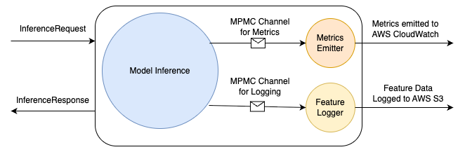

## hushar [ हुशार ]

* A simple gRPC server for Machine Learning (ML) Model Inference in Rust.
* Name of the project, `हुशार`,  is the मराठी [ Marāṭhī ] translation of the word `intelligent`.
* `हुशार` uses [tract](https://github.com/sonos/tract) as the inference engine.

### Assumptions

1. A single host can serve a single model.
2. All required features are included in the request payload. The client is responsible for collecting these features.
3. We want to emit metrics and log inputs and outputs.

### Directory structure

1. `benchmark-client` &rarr; basic client to generate 4k requests per second.
2. `benchmark-data` &rarr; service and vectorization configurations for the model generated by
   [benchmark script](scripts/generate_benchmark_model.py).
3. `hushar` &rarr; the service code
4. `schemas` &rarr; protocol-buffer definitions for gRPC service and data.
5. `scripts` &rarr; python code to generate ONNX model for unit testing and benchmarking.

### High Level Details 

* Hushar [service](hushar/src/main.rs#L31) takes [InferenceRequest](schemas/protos/structs.proto#L7)
as an input payload and returns [InferenceResponse](schemas/protos/structs.proto#L12). 
* Server side metrics are collected an emitted by a [metrics sidecar](hushar/src/io/side_car.rs#L11).
* [Feature logger sidecar](hushar/src/io/side_car.rs#L62) writes the input features, modelId, requestId and model outputs to AWS S3

* Why are we using sidecar pattern?
  * Offloads metrics/logging I/O from main request path, preventing latency spikes.
  * Sidecars have their own compute resources; main server thread pool remains dedicated to serving requests.
  * Sidecars can batch metrics/logs without blocking request threads.

### Low Level Details

* Command to start the server binary &rarr; `./hushar <IP_ADDRESS> <SERVICE_CONFIG_PATH> <INFERENCE_LOG_PATH> 
  <METRICS_THREAD_COUNT> <LOG_THREAD_COUNT>`
* We are using [tokio](https://tokio.rs/); as it provides a lightweight runtime with minimal resource consumption for 
  handling concurrent requests.
* The total number of threads started matches the number of available CPU cores. CLI parameters controls the sidecar
  thread count. To update the thread count for ML inference runtime, we can update the [code](hushar/src/main.rs#L105).
* For communication between the service runtime and the sidecars, 
  we are using [async_channel](https://docs.rs/async-channel/latest/async_channel/) crate, which provides
  multi-producer multi-consumer channel (MPMC), where each message can be received by only one of all existing consumers.
* For efficient memory utilization the ML model and vectorization configuration is loaded into memory only once. 
  Instances are shared across threads using [Arc](https://doc.rust-lang.org/std/sync/struct.Arc.html);
  a thread-safe reference-counting pointer.

#### Feature Processing

The vectorization configuration file defines how input features are transformed into a single flat vector for ML model 
inference. It contains two main components: `feature_transformations` (a map of feature names to their transformation 
specifications with type and parameters) and `feature_order` (an ordered list determining the sequence in which 
transformed features are concatenated into the final input vector). 
[DataType](schemas/protos/structs.proto#L27) structure defines a generic type to hold the supported feature types.

Supported transformations :-
1. Embedding &rarr; Maps string values to pre-trained vector embeddings using a lookup table; 
   returns default vector for unknown strings.
2. Identity &rarr; Passes through numerical values with type casting to f32; 
   parses string values to floats when possible.
3. MinMaxScaling32/64 &rarr; Normalizes 32-bit or 64-bit numerical values to [0, 1] range 
   using formula: (value - min) / (max - min).
4. OneHotEncoding &rarr; Converts categorical string values into binary vectors where only the matching category 
   index is 1, all others are 0
5. Standardization32/64 &rarr; Standardizes 32-bit or 64-bit numerical values using z-score 
   normalization: (value - mean) / std_dev.

#### ML Model Inference

The [`batch_inference`](hushar/src/inference/scoring.rs#L32) function orchestrates the complete ML model inference.

1. Vectorization &rarr; Transforms input features into flat numerical vectors using the vectorization config.
2. Tensor Creation &rarr; Reshapes the vectorized features into a 2D batch tensor with dimensions `(batch_size, feature_length)`.
3. Model Execution &rarr; Runs the tract ONNX model on the batch tensor to generate predictions.
4. Output Processing &rarr; Extracts prediction scores from the output tensor and packages them into OutputRow and InferenceLogRow structures.

#### Feature Logging Side-Car

The [`feature_logger`](hushar/src/io/side_car.rs#L62) function receives inference log batches through an async channel, 
buffers them until reaching capacity, then serializes them as Protocol Buffer messages and writes them to AWS S3 with 
time-partitioned keys (year/month/day/hour/minute). Multiple workers can run concurrently to handle high-throughput 
logging without impacting request latency.

#### Metrics Emitting Side-Car

The [`metrics_emitter`](hushar/src/io/side_car.rs#L11) function receives inference timing metrics (vectorization, tensor creation, and inference times) 
through an async channel, buffers them until reaching capacity, then batches and sends them to AWS CloudWatch. 
Multiple workers can run concurrently, each processing metrics independently to prevent blocking the main request path.

### Future Improvements

1. Model is loaded into memory as the service starts. This forces the server to be restarted for updating the model. 
   We can implement periodic polling to update the model and the configuration.
2. The logs are emitted directly to object storage. This can create backpressure, reducing the server efficiency.
   We can emit the logs to a message queue, like Kafka or AWS Kinesis, for stream processing. 

#### Experimentation

An experimentation set-up is crucial for every machine learning system. Experimentation management can be server-side or
client-side. Client-side experimentation management is most effective with a unified tracking system capable
of capturing and correlating metrics across multiple services (conversion, revenue, engagement), and accessible user
context and features at the application layer. This approach is optimal when stable downstream services are available
for integration, real-time synchronous calls are acceptable, and the primary goal is measuring holistic business
impact rather than isolated model performance metrics. In absence of a robust experimentation platform, we can improve
the service with experimentation support for model performance enhancements. 

