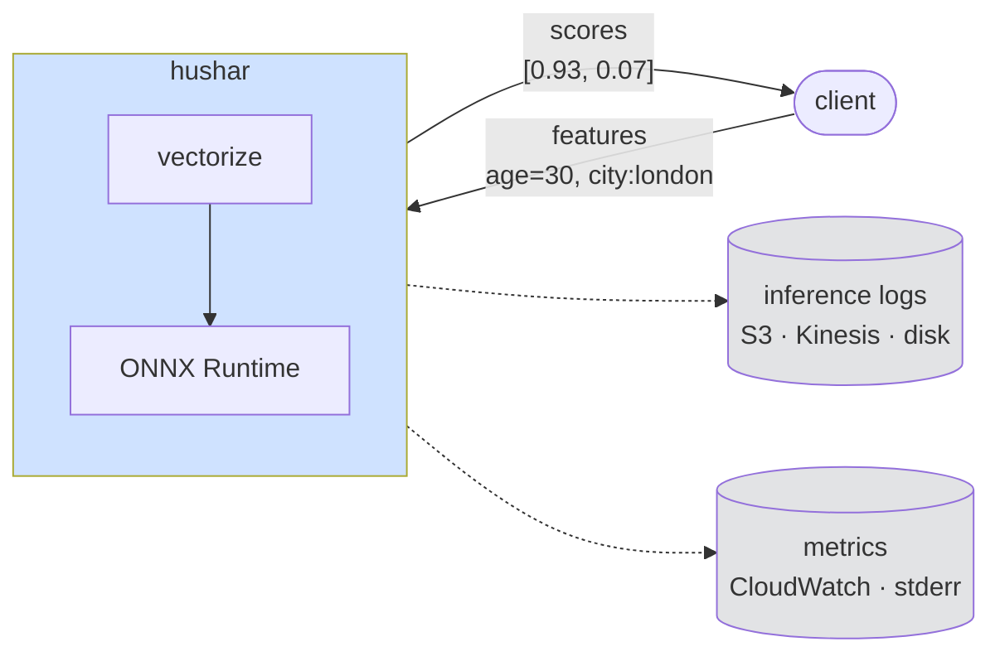
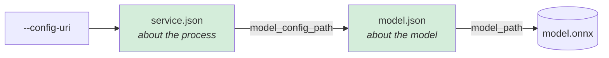
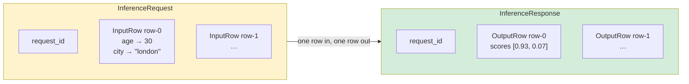

<div align="center">

# hushar &nbsp;·&nbsp; हुशार

**A gRPC server for machine-learning model inference, written in Rust.**

`हुशार` is मराठी [ Marāṭhī ] for *intelligent*.

</div>



```mermaid
flowchart LR
  client(["client"]) -->|"features<br/>age=30, city:london"| h
  h -->|"scores<br/>[0.93, 0.07]"| client
  subgraph h["hushar"]
    direction TB
    v["vectorize"] --> e["ONNX Runtime"]
  end
  h -.-> logs[("inference logs<br/>S3 · Kinesis · disk")]
  h -.-> met[("metrics<br/>CloudWatch · stderr")]
  style h fill:#cfe2ff
  style logs fill:#e2e3e5
  style met fill:#e2e3e5
```

The dotted arrows never block a response. Everything else about this service follows
from that, and from one more idea: **there is no tensor on the wire.** A caller sends
values with names, and a configuration file — checked against the model at startup —
says how they become inputs.

---

## Quick start

Five steps, one model, one request.

### 1 · Get ONNX Runtime

The engine is loaded at run time, never linked, so this is a download rather than a
build dependency. The
[releases page](https://github.com/microsoft/onnxruntime/releases) carries a prebuilt
shared library for every platform, named `onnxruntime-<os>-<arch>-<version>`:

| Platform            | Asset for 1.29.0 | Library inside `lib/` |
|---------------------|---|---|
| Linux x64           | `onnxruntime-linux-x64-1.29.0.tgz` | `libonnxruntime.so` |
| Linux arm64         | `onnxruntime-linux-aarch64-1.29.0.tgz` | `libonnxruntime.so` |
| NVIDIA GPU, CUDA 12 | `onnxruntime-linux-x64-gpu_cuda12-1.29.0.tgz` | `libonnxruntime.so` |

Unpack it and point `ORT_DYLIB_PATH` at the library:

```bash
# Linux
export ORT_DYLIB_PATH=$PWD/onnxruntime-linux-x64-1.29.0/lib/libonnxruntime.so
```

Already have ONNX Runtime installed system-wide? Leave `ORT_DYLIB_PATH` unset and the
usual library names are tried for you —
[hardware.md](documentation/hardware.md#finding-the-runtime) lists them.

### 2 · Make a model

Three features in, two scores out — a sigmoid over a linear layer with fixed weights,
so the answer is predictable.

```bash
pip install -r scripts/requirements.txt
python scripts/generate_test_model.py 3
# wrote hushar/test-data/sigmoid_model_3.onnx
# wrote onnxrt-rs/test-data/sigmoid_model_3.onnx
```

### 3 · Write two config files


```mermaid
flowchart LR
  a["--config-uri"] --> s["service.json<br/><i>about the process</i>"]
  s -->|"model_config_path"| m["model.json<br/><i>about the model</i>"]
  m -->|"model_path"| o[("model.onnx")]
  style s fill:#d4edda
  style m fill:#d4edda
```
```bash
cat > service.json <<'EOF'
{
  "port_number": 50051,
  "model_config_path": "model.json",
  "inference_log": { "uri": "./logs" }
}
EOF

cat > model.json <<'EOF'
{
  "model_id": "quickstart",
  "model_path": "hushar/test-data/sigmoid_model_3.onnx",
  "vectorization_config": { "feature_order": ["f1", "f2", "f3"] }
}
EOF
```

`feature_order` is the whole mapping here: three features, concatenated in that order,
into the model's one 3-wide float input. Every other field has a default.

### 4 · Run it

One flag, because `service.json` carries everything else — the listener, where inference
logs go, and where timings go.

```bash
cargo run --release -p hushar -- --config-uri ./service.json
```

The banner is the contract — read it before sending anything:

```
hushar: model quickstart loaded on onnxruntime/CPU (runtime 1.29.0)
  inputs   : input FP32[3]
  outputs  : output FP32[2]
  features : 1 binding(s)
             input FP32[3] <- [f1, f2, f3] transformed and concatenated
hushar: metrics -> stderr [every 500 batches, 4 in flight]
hushar: inference logs -> ./logs [local filesystem, every 5000 batches, 4 in flight, logging every request]
hushar: threads -> 8 async, 8 inference x 1 intra-op x 1 session(s) = 8 compute on 8 core(s)
  admit  : 500 in flight per connection
hushar: listening on 0.0.0.0:50051
```
```

### 5 · Send a request

```bash
SMOKE_FEATURES='f1=1.0,f2=2.0,f3=3.0' \
  SERVER_ADDR=http://127.0.0.1:50051 \
  cargo run -p benchmark-client --example smoke
#   row-0 FP32 = [0.9568927, 0.9568927]
```

`name=value` is a number, `name:value` is text — kept apart because `city=1` and
`city:1` mean different things to a one-hot encoding.

---

## Request and response


```mermaid
flowchart LR
  subgraph req["InferenceRequest"]
    direction TB
    rid["request_id"]
    r0["InputRow row-0<br/>age → 30<br/>city → &quot;london&quot;"]
    r1["InputRow row-1<br/>…"]
  end
  subgraph res["InferenceResponse"]
    direction TB
    sid["request_id"]
    o0["OutputRow row-0<br/>scores [0.93, 0.07]"]
    o1["OutputRow row-1<br/>…"]
  end
  req -->|"one row in, one row out"| res
  style req fill:#fff3cd
  style res fill:#d4edda
```

- One `InputRow` per row you want scored; rows are batched into a single engine call.
- `scores` is a `oneof` over `FloatArray` and `DoubleArray`, so a model asked for double
  precision is not narrowed on the way out.
- Already vectorized? Send your vector as one feature whose value is a `FloatArray`. A
  pass-through transformation hands it to the model unchanged, so there is still only
  one request shape.
- Only the model's **first output** is returned — class probabilities, a regression
  value, a forecast horizon or an embedding.

Definitions live in [`schemas/protos`](schemas/protos/structs.proto).

---

## Where things live

```
hushar/            the service
onnxrt-rs/         safe Rust front end over the ONNX Runtime C API   (in use)
libnrt-rs/         safe Rust front end over the AWS Neuron C API     (backend not written)
schemas/protos/    gRPC service and message definitions
scripts/           model generators, and scripts/benchmark/ for a two-host run
benchmark-client/  load generator, plus the one-shot `smoke` example
benchmark-data/    generated models (ignored) and curated results (tracked)
documentation/     the docs below
```

## Where to read next

| Doc | Answers |
|---|---|
| [configuration.md](documentation/configuration.md) | every config field, CLI flag, transformation and data type |
| [hardware.md](documentation/hardware.md) | choosing an execution provider, build features, testing on accelerators |
| [threads-and-cores.md](documentation/threads-and-cores.md) | thread pools, how many of each, and which cores they run on |
| [benchmarking.md](documentation/benchmarking.md) | running a benchmark on real instances, client and server on separate hosts |
| [request-walkthrough.md](documentation/request-walkthrough.md) | one request, socket to response, function by function |
| [bindgen.md](documentation/bindgen.md) | why the FFI bindings are checked in and the library loaded at run time |
| [benchmark-data/README.md](benchmark-data/README.md) | where a benchmark's inputs and results live, and how to record one |

## Testing

Unit tests need nothing. The tests that exercise real inference skip with a reason when
no ONNX Runtime is present.

```bash
cargo test              # unit tests only
export ORT_DYLIB_PATH=… # the library from step 1
cargo test              # everything, on CPU
```

## Future Scope

- **Model reloading.** The model is read at startup, so updating one means a restart.
- **A Neuron backend** for Inferentia and Trainium. [`libnrt-rs`](libnrt-rs/README.md)
  is ready and the trait has four methods; it needs the hardware to test against.

## Licence

MIT. See [LICENSE](LICENSE).
