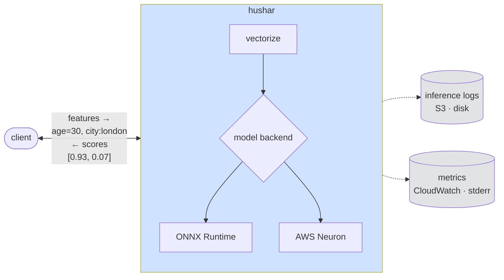
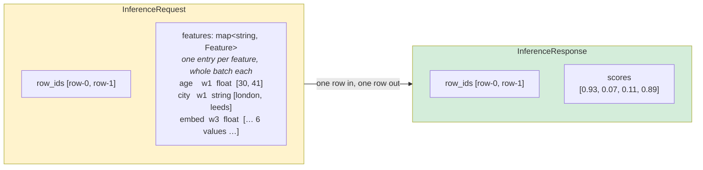

<div align="center">

# hushar &nbsp;·&nbsp; हुशार

**A gRPC server for low-latency tabular model inference.**

`हुशार` is मराठी [ Marāṭhī ] for *intelligent*.

[Quick start](#quick-start) &nbsp;·&nbsp; [The contract](#features-in-scores-out)
&nbsp;·&nbsp; [Docs](#documentation)

</div>



```mermaid
flowchart LR
  client(["client"]) <-->|"features →<br/>age=30, city:london<br/>← scores<br/>[0.93, 0.07]"| h
  subgraph h["hushar"]
    direction TB
    v["vectorize"] --> e{"model backend"}
    e --> o["ONNX Runtime"]
    e --> n["AWS Neuron"]
  end
  h -.-> logs[("inference logs<br/>S3 · disk")]
  h -.-> met[("metrics<br/>CloudWatch · stderr")]
  style h fill:#cfe2ff
  style logs fill:#e2e3e5
  style met fill:#e2e3e5
```

The dotted arrows never block a response. Everything else about this service follows from
that, and from one more idea: **there is no tensor on the wire.** A caller sends values with
names, and a configuration file, checked against the model at startup, says how they become
model inputs.

---

## Quick start

Pick your hardware. Each guide is five steps, one throwaway model, and one scored request.

| Your hardware | Guide | What is different about it |
|---|---|---|
| any CPU: Graviton, Ampere, Intel, AMD | [quickstart-cpu.md](documentation/quickstart-cpu.md) | nothing to install but the engine; start here if unsure |
| NVIDIA or AMD GPU | [quickstart-gpu.md](documentation/quickstart-gpu.md) | a GPU-enabled engine, one Cargo feature, and a graph that compiles on first use |
| Trainium or Inferentia | [quickstart-neuron.md](documentation/quickstart-neuron.md) | a precompiled NEFF with a fixed batch, placed on NeuronCores |

The engine is loaded at run time and never linked, so every one of those is a download
rather than a build dependency, and one binary reads the same `model.json` on all of them.

## Features in, scores out

```bash
cargo run -p benchmark-client --example smoke
#   row-0 FP32 = [0.9568927, 0.9568927]
```


```mermaid
flowchart LR
  subgraph req["InferenceRequest"]
    direction TB
    ids["row_ids [row-0, row-1]"]
    arw["features: map&lt;string, Feature&gt;<br/><i>one entry per feature, whole batch each</i><br/>age    w1  float  [30, 41]<br/>city   w1  string [london, leeds]<br/>embed  w3  float  [… 6 values …]"]
  end
  subgraph res["InferenceResponse"]
    direction TB
    oids["row_ids [row-0, row-1]"]
    osc["scores<br/>[0.93, 0.07, 0.11, 0.89]"]
  end
  req -->|"one row in, one row out"| res
  style req fill:#fff3cd
  style res fill:#d4edda
```

One request is a batch of rows. Features arrive as a `map<string, Feature>`, one entry per
feature carrying that feature's values for the whole batch, so a name travels once per
request rather than once per row: at 100 rows over 210 features that is 210 names instead
of 21,000. Values may be float, double, int32, int64 or string, one type per feature. Row
identity is `row_ids`, and the response returns the same ids in the same order with one
score buffer for the whole batch.

Already have a finished vector? That is the ordinary case: send it as one entry of that
width with an `identity` transformation, and it reaches the model unchanged.

Anything that speaks protobuf can build the payload, in any language with a generated
client and nothing else to install. [api.md](documentation/api.md) is the full contract;
the definitions are in [`schemas/protos`](schemas/protos/structs.proto).

## Where things live

```
hushar/            the service
onnxrt-rs/         safe Rust front end over the ONNX Runtime C API
libnrt-rs/         safe Rust front end over the AWS Neuron C API
hushar/src/inference/{onnx,neuron}_backend.rs   engine adapters
schemas/protos/    gRPC service and message definitions
scripts/           model generators, and scripts/benchmark/ for a two-host run
benchmark-client/  load generator, plus the `smoke` and `inspect_log` examples
benchmark-data/    generated models and retired results (ignored), new results (tracked)
documentation/     the docs below
```

## Documentation

| | Doc | Answers |
|---|---|---|
| **Run it** | [quickstart-cpu.md](documentation/quickstart-cpu.md) | first server and first request, on any CPU |
| | [quickstart-gpu.md](documentation/quickstart-gpu.md) | the same on NVIDIA through TensorRT or AMD through MIGraphX |
| | [quickstart-neuron.md](documentation/quickstart-neuron.md) | the same on Trainium and Inferentia, from NEFF to NeuronCore placement |
| **Use it** | [api.md](documentation/api.md) | the request and response contract, and why it has that shape |
| | [configuration.md](documentation/configuration.md) | every config field, CLI flag, transformation and data type |
| | [hardware.md](documentation/hardware.md) | choosing an execution provider, build features, building a runtime that is not prebuilt |
| | [threads-and-cores.md](documentation/threads-and-cores.md) | thread pools, how many of each, and which cores they run on |
| **Measure it** | [benchmarking.md](documentation/benchmarking.md) | a two-host run on real instances, and how a run is recorded |
| **Read it** | [request-walkthrough.md](documentation/request-walkthrough.md) | one request, socket to response, function by function |
| | [bindgen.md](documentation/bindgen.md) | why the FFI bindings are checked in and the library loaded at run time |

## Testing

Unit tests need nothing. The tests that exercise real inference skip with a reason when no
ONNX Runtime is present, so the suite stays green everywhere.

```bash
cargo test                   # unit tests only
export ORT_DYLIB_PATH=…      # a library from any quick start, step 1
cargo test                   # everything, on CPU
cargo test --features tensorrt   # plus TensorRT, on an NVIDIA host
cargo test -p hushar neuron      # Neuron signature and config tests; hardware validation uses a NEFF
```

## Licence

MIT. See [LICENSE](LICENSE).
