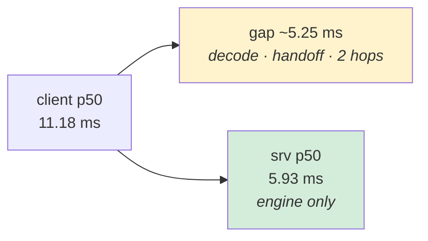

# Benchmark results

Peak sustained rate per configuration. A row is a **sustained** measurement: achieved ≈ offered
with `shed = 0` and `failed = 0`. Anything that shed is not a result and is not here.

Two threadings are measured, each on the default CPU provider and on the platform's
accelerator, at 50 rows per request:

| Conf | mini batch | inf | intra | sess | requests per session |
|---|---|---|---|---|---|
| **A** | 5 | 16 | 1 | 1 | 16, ten engine calls each |
| **B** | 50 | 8 | 11 | 8 | **1** |

On an accelerator, conf-B's 11 threads move from ONNX Runtime to the provider —
`intra 1` plus `xnnpack:11` or `openvino:CPU:threads=11:streams=1`. Conf-B is the balanced
case: one inference per session, and `8 × 11 = 88` intra-op threads on the 88 compute cores.

| Date | Instance | Model | Params | Provider | Conf | Parallelisation | rows | TPS | p50 | p95 | srv p50 | srv p95 | CPU % | Mem % | Report |
|---|---|---|---|---|---|---|---|---|---|---|---|---|---|---|---|
| 2026-09-12 | **c8i.24xlarge** | transformer / raw | 10M | onnxruntime/CPU | **A** | conn 512 · async 16 · inf 16 · intra 1 · sess 1 · spin off · cores 1-7/8-95 · mini batch 5 | 50 | **400** | **11.18** | 14.29 | **5.93** | 8.29 | 24.4 | 0.4 | [openvino](cpu-x86/c8i-24xlarge-openvino-2026-09-12.md) |
| 2026-09-12 | c9g.24xlarge | transformer / raw | 10M | onnxruntime/CPU | A | conn 512 · async 16 · inf 16 · intra 1 · sess 1 · spin off · cores 1-7/8-95 · mini batch 5 | 50 | **400** | 12.21 | 13.85 | 8.07 | 8.51 | 36.5 | 0.3 | [xnnpack](cpu-arm64/c9g-24xlarge-xnnpack-2026-09-12.md) |
| 2026-09-12 | c9g.24xlarge | transformer / raw | 10M | onnxruntime/CPU | B | conn 512 · async 16 · inf 8 · intra 11 · sess 8 · spin off · cores 1-7/8-95 · mini batch 50 | 50 | **400** | 14.23 | 16.85 | 9.85 | 10.31 | 33.8 | 0.6 | [xnnpack](cpu-arm64/c9g-24xlarge-xnnpack-2026-09-12.md) |
| 2026-09-12 | c8i.24xlarge | transformer / raw | 10M | onnxruntime/CPU | B | conn 512 · async 16 · inf 8 · intra 11 · sess 8 · spin off · cores 1-7/8-95 · mini batch 50 | 50 | **400** | 19.98 | 23.67 | 13.02 | 15.74 | 38.7 | 0.6 | [openvino](cpu-x86/c8i-24xlarge-openvino-2026-09-12.md) |
| 2026-09-12 | c8i.24xlarge | transformer / raw | 10M | onnxruntime/**OpenVINO**(CPU, threads=11, streams=1) | B | conn 512 · async 16 · inf 8 · intra 1 · sess 8 · spin off · cores 1-7/8-95 · mini batch 50 | 50 | **100** | 13.72 | 14.82 | 8.40 | **101.34** | 10.3 | 1.4 | [openvino](cpu-x86/c8i-24xlarge-openvino-2026-09-12.md) |
| 2026-09-12 | c9g.24xlarge | transformer / raw | 10M | onnxruntime/**XNNPACK**(threads=11) | B | conn 512 · async 16 · inf 8 · intra 1 · sess 8 · spin off · cores 1-7/8-95 · mini batch 50 | 50 | **100** | 82.15 | 83.62 | 77.78 | 78.36 | 8.2 | 1.0 | [xnnpack](cpu-arm64/c9g-24xlarge-xnnpack-2026-09-12.md) |

**Conf-A on an accelerator has no row because it does not sustain any rate.** XNNPACK managed
16.8 req/s of an offered 100 and OpenVINO 19.2, both at **~1.3 % CPU** with 88 cores idle.
Mini-batching asks for ten concurrent engine calls per request and `sess 1` supplies one pool;
server-side `InferenceTime` reads **~1.2 s**, which times the engine call alone, so the queue is
inside the provider. Each report has the failure in full.

## Findings

**The CPU provider wins on both machines and both threadings.** The accelerators cap out where
it is still comfortable — XNNPACK at 100 req/s, OpenVINO at 100, against 400 — and neither cap
is a compute limit.

**XNNPACK is 7.9× slower per engine call** (77.66 against 9.26 ms at matched shape) and its
ceiling is set by `sessions_per_model`. **OpenVINO is 1.5× *faster* per call** (8.40 against
12.78 ms) and still unusable: its ceiling ignores sessions, `inference_concurrency` and a
doubling of the physical cores alike, admitting ~1.5 concurrent inferences regardless, with a
server-side p95 12× its p50 at the rate it passes. A per-session limit is configurable; a global
one is not. For OpenVINO the untried knob is `streams`.

**Mini batches beat a wide intra-op pool.** Conf-A is 14 % faster than conf-B on Graviton and
44 % faster on Intel. Threads inside one operator stop helping well before the core count —
the operators are a chain and each is a barrier — while separate mini batches share no barrier
at all. The catch is that conf-A cannot run on an accelerator without at least ten sessions.

**Which instance wins depends on the threading, and physical cores are why.** `c8i.24xlarge`
takes conf-A by 8 % on `amx_tile` and a 27 % faster engine call, despite having **half the
physical cores** (48 against 96). `c9g.24xlarge` takes conf-B by 29 %, because 88 intra-op
threads fit one-per-core there and must share on the Xeon.

**A third of end-to-end latency is not the engine.** `client p50 − srv p50` is a near-constant
**~4 ms on Graviton and ~5 ms on Intel**, flat across offered rate, and it is **47–56 %** of the
best configuration's total. It scales with rows × features rather than with load, which points
at request decode: `InputRow` carries `map<string, DataType>`, so a 50-row request re-sends all
212 feature names — **10,600 map entries and ~285 KiB per request**. None of that path is
instrumented; only `VectorizationTime`, `ToTensorTime` and `InferenceTime` are.

## What a row means

`p50`/`p95` are what a **caller** saw; `srv p50`/`srv p95` are the engine call alone. The gap is
everything that is not the engine: request decode, admission, the blocking-pool handoff, and two
network hops.

`Parallelisation` is the whole `threading` config in banner order, because it is the only column
that explains the others. `rows` is a column and not prose because it decides the rest: load is
`rows × TPS`, and latency is close to linear in `rows` while parallelism inside one request is
not.

⚠️ **`CPU %` is not comparable across the two machines.** The sampler reads all of `/proc/stat`:
96 logical CPUs on both, but those are 96 physical cores on the c9g and 48 physical cores with
two threads each on the c8i.

Columns and their sources: [TEMPLATE.md](TEMPLATE.md). How to run one:
[documentation/benchmarking.md](../../documentation/benchmarking.md). Classes: `cpu-arm64`
(Graviton), `cpu-x86` (Intel), `gpu-nvidia`.

Raw artefacts for every arm, including those not tabulated here, are under
`raw/2026-09-12-accel/` and `s3://hushar-bench-119928111785-us-west-2/runs/2026-09-12-accel/`.
