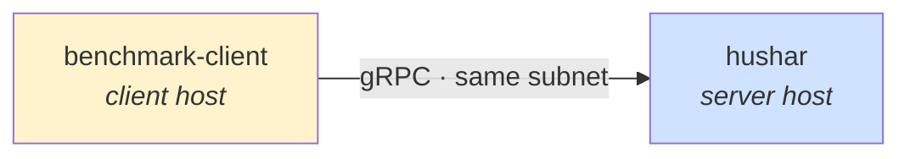
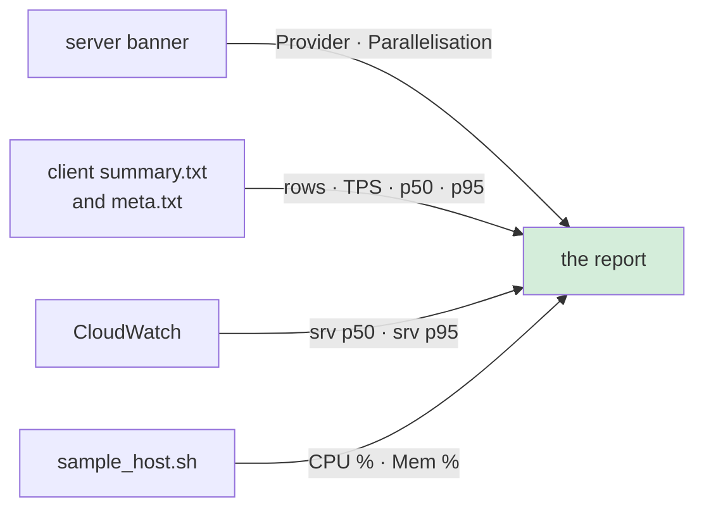

# Benchmarking

Two hosts in the same subnet: the client offers a fixed rate, the server is under test.



Run everything from the repository root, or from the unpacked bundle root.

## 1 · Package — laptop

```bash
python scripts/generate_benchmark_models.py     # once
scripts/benchmark/package.sh                    # source, scripts, configurations
```

Models are not in the bundle. Stage them once and pull on each server host:

```bash
aws s3 sync benchmark-data/generated s3://my-bucket/hushar-bench/generated/
# server host:
aws s3 sync s3://my-bucket/hushar-bench/generated/ benchmark-data/generated/
```

## 2 · Upload

```bash
BUNDLE=$(ls -t benchmark-data/dist/*.tgz | head -1)
for host in "$SERVER_HOST" "$CLIENT_HOST"; do
  scp "$BUNDLE" "$host":~/ && ssh "$host" "tar xzf $(basename "$BUNDLE")"
done
```

Open the server's port — 8279 by default — to the client's security group.

## 3 · Bootstrap — once per host

```bash
cd hushar-bench-<sha>
scripts/benchmark/bootstrap.sh --role server --provider cpu
scripts/benchmark/bootstrap.sh --role client          # no engine on the client
```

The server host needs credentials that allow `cloudwatch:PutMetricData` — an instance role
is easiest — or the server-side percentiles cannot be collected. Nothing else to install:
the CPU and memory sampler reads `/proc`.

| `--provider` | Library |
|---|---|
| `cpu` *(default)* | `onnxruntime-linux-{x64,aarch64}` |
| `tensorrt` | `onnxruntime-linux-x64-gpu_cuda12` |
| `xnnpack`, `openvino` | none published — `scripts/benchmark/build_ort.sh <provider>` first, then pass `ORT_DYLIB_PATH` and `LD_LIBRARY_PATH` |

`--provider` is also a **Cargo feature**. A server built without it refuses the
configuration at startup even when the library has the provider compiled in.

## 4 · Run

```bash
# server host — starts once, serves the whole sweep
MODEL=raw-ab PROVIDER=cpu WORKER_THREADS=24 INFERENCE_CONCURRENCY=8 THREADS=21 \
  CW_NAMESPACE=HusharBench \
  scripts/benchmark/run_server.sh start
```

Read the banner: it names the provider **actually registered**, the thread counts, and the
admission limit. Those lines are the report's `Provider` and `Parallelisation` columns, so
keep them.

`CW_NAMESPACE` is what makes the report's **server-side** percentiles possible: timings go
to CloudWatch as one data point per scored batch, and CloudWatch holds the distribution.
Without it timings only reach the server log, which carries means and no percentiles.

An execution provider that brings a thread-pool of its own — XNNPACK, OpenVINO — wants the
opposite arrangement, and `ALLOW_SPINNING=0` so ONNX Runtime's idle threads sleep rather
than competing with it. The banner reports spinning whenever it is configured, so a report
can say which was measured:

```bash
MODEL=raw-ab PROVIDER='openvino:CPU:threads=21:streams=1' \
  WORKER_THREADS=24 INFERENCE_CONCURRENCY=8 THREADS=1 ALLOW_SPINNING=0 \
  LABEL=c8i-openvino \
  CW_NAMESPACE=HusharBench \
  LOG_URI=s3://my-bucket/inference-logs \
  scripts/benchmark/run_server.sh start
```

`LABEL` names the run's files, which a provider string carrying options otherwise makes
unwieldy. `LOG_URI` puts rows in S3, so the measurement exercises the paths a deployment
actually uses and the results outlive the instance.

```bash
# server host — one sampler covers the whole sweep, for the CPU % and Mem % columns
scripts/benchmark/sample_host.sh start
```

```bash
# client host
SERVER=http://10.0.1.23:8279 MODEL=raw TPS="100 200 300" \
  DURATION=45 WARMUP=15 ROWS=100 scripts/benchmark/run_client.sh
```

The client is told the **control arm's** model, so a `raw-ab` server is driven with
`MODEL=raw` — every arm takes the same features. Sweep until something sheds, then stop:
the last rate with `shed = 0` and `achieved ≈ offered` is the answer.

Note the wall-clock time the sweep started and ended; §6 needs it to cut the CloudWatch
window to the measured part.

## 5 · Collect

```bash
# server host
scripts/benchmark/sample_host.sh stop
scripts/benchmark/run_server.sh stop
scripts/benchmark/hostinfo.sh > /tmp/hushar-server/hostinfo.txt

# laptop
scp -r "$SERVER_HOST":/tmp/hushar-server ./
scp -r "$CLIENT_HOST":/tmp/hushar-client/<label> ./

STEM=c9g-48xlarge-cpu-2026-09-11
aws s3 sync /tmp/hushar-client/<label>/ "s3://my-bucket/hushar-bench/$STEM/client/"
aws s3 sync /tmp/hushar-server/         "s3://my-bucket/hushar-bench/$STEM/server/"
```

## 6 · Record

```bash
cp benchmark-data/results/TEMPLATE.md \
   benchmark-data/results/cpu-arm64/c9g-48xlarge-cpu-2026-09-11.md
```

Thirteen columns, four sources — the template names every one:



```bash
# srv p50/p95 — µs in CloudWatch, ms in the report, averaged over the arms
START=2026-09-10T18:00:00Z END=2026-09-10T18:45:00Z \
  scripts/benchmark/server_latency.sh HusharBench bench-raw bench-raw-candidate

# CPU % and Mem % — per rate, in seconds from the first sample
scripts/benchmark/sample_host.sh report 0 45     # the first rate
scripts/benchmark/sample_host.sh report 45 90    # the second
```

Both windows matter. `START`/`END` cut CloudWatch to the measured sweep rather than
including the warmup and the idle tail; `report <from> <to>` does the same for the host
samples, in seconds from the first sample so no clock arithmetic is needed.

Then fill the table from `summary.txt`, add the peak row to
[`results/index.md`](../benchmark-data/results/index.md), and commit. Classes are
`cpu-arm64`, `cpu-x86` and `gpu-nvidia`.

## When it goes wrong

| Symptom | Cause |
|---|---|
| client cannot connect | port not open to the client's security group, or the server bound `127.0.0.1` |
| `failed > 0` | not a capacity finding — read the server log |
| everything sheds, latency flat | the **client** is the bottleneck; use a bigger client host |
| server will not start | `ORT_DYLIB_PATH` unset or wrong, or the model is missing |
| provider in the banner is not the one you asked for | the host's `libonnxruntime` lacks it |
| first rate much slower than the second | raise `WARMUP` |
| `build.rs` fails on the instance | `protoc` missing — `--skip-packages` does not install it |
