# How the FFI crates work

This workspace has two crates that wrap a C library: `onnxrt-rs` over the ONNX
Runtime C API, and `libnrt-rs` over the AWS Neuron runtime (`libnrt`) C API. Both
are generated with [`bindgen`](https://rust-lang.github.io/rust-bindgen/).

**Part I** explains `bindgen` and the surrounding design in general terms, with
nothing specific to either library. **Part II** and **Part III** then cover what
is particular to ONNX Runtime and to libnrt.

Diagrams are [Mermaid](https://mermaid.js.org/), which GitHub renders inline.

---

# Part I — bindgen in general

## 1. The problem

Rust and C agree on a calling convention but share no type system. Nothing in a
`.h` file is visible to `rustc`.

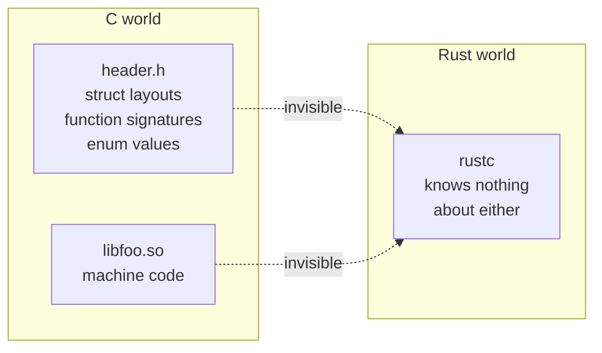

Somebody has to restate every struct, signature, and constant in Rust. Doing it
by hand is how it goes wrong: a field in the wrong order, a `u32` where the header
said `u64`, a missing padding byte. None of that fails to compile. It corrupts
memory at run time, far from the mistake that caused it.

`bindgen` does the restating mechanically, from the header itself.

## 2. What bindgen does

`bindgen` is a `libclang` client. It hands the header to a real C compiler front
end, walks the resulting AST, and emits Rust.

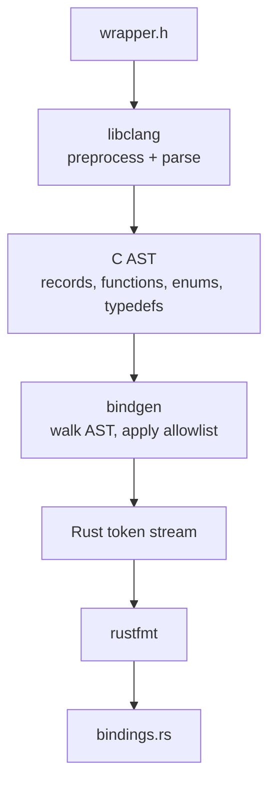

Two things follow from it being a real C front end:

- **`#include` and `#define` are resolved properly.** Macros expand, nested
  includes are followed, conditional compilation is evaluated. Nothing is
  regex-guessed.
- **libclang is needed to *generate*.** Not to *use* the result. Section 5 turns
  on that distinction.

## 3. Why the allowlist matters

A header drags in the platform's entire `stdint.h`, `stddef.h`, and more. Without
filtering, the output fills with types nobody asked for.

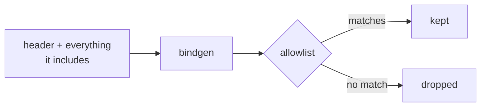

Both crates allowlist by prefix — `Ort.*` and `ONNX.*` for one, `nrt_*` and
`NRT_*` for the other — so the output describes the API being wrapped and not the
host's libc.

## 4. What comes out, and how it is proven correct

`bindgen` emits four kinds of thing:

| Emitted | Example |
|---|---|
| type definitions | `struct`s, `enum`s, typedefs, opaque handles |
| function signatures | `extern "C"` declarations |
| constants | `#define` and enum values |
| **layout assertions** | compile-time size, alignment, and offset checks |

The last one is the safety net, and it is easy to miss. `bindgen` does not hope
the struct matches — it emits assertions that fail the build if it does not:

```rust
const _: () = {
    ["Size of nrt_tensor_info"][::std::mem::size_of::<nrt_tensor_info>() - 296usize];
    ["Alignment of nrt_tensor_info"][::std::mem::align_of::<nrt_tensor_info>() - 8usize];
    ["Offset of field: nrt_tensor_info::name"]
        [::std::mem::offset_of!(nrt_tensor_info, name) - 0usize];
    ["Offset of field: nrt_tensor_info::usage"]
        [::std::mem::offset_of!(nrt_tensor_info, usage) - 256usize];
    // … size at 264, dtype at 272, shape at 280, ndim at 288
};
```

That is copied verbatim from `libnrt-rs`. The array-index trick is deliberate: if
the size is not exactly 296, the subtraction underflows and indexing a 1-element
array with an enormous number fails **at compile time**.

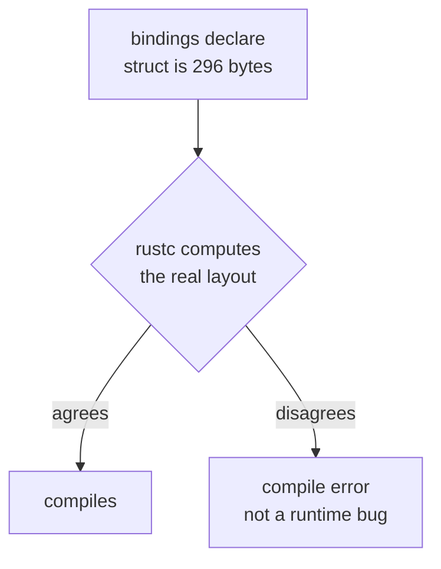

So the dangerous failure — a layout that quietly disagrees — becomes a build
failure. Note the limit: this checks the bindings against **the compiler's view of
the types they declare**, which catches target and ABI mismatches. It cannot
notice that the header changed upstream. Only regenerating does that.

## 5. Generate at build time, or commit the output?

Running `bindgen` from `build.rs` on every build is the common choice. Both crates
here do the opposite: the generated file is **committed**, and regenerating is
opt-in behind a cargo feature.

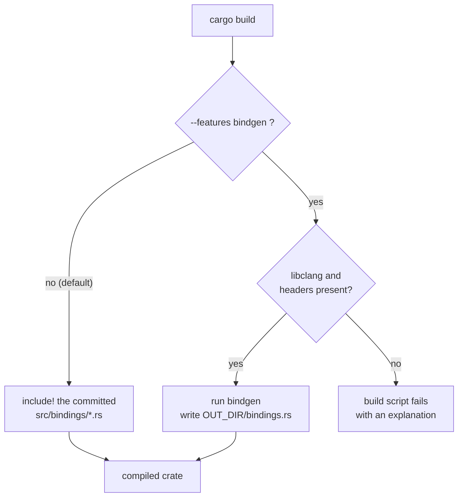

The tradeoff:

| | Generate every build | Commit the output |
|---|---|---|
| needs libclang | always | only to regenerate |
| needs the C headers | always | only to regenerate |
| always matches the header | yes | can drift |
| bindings reviewable in a diff | no | yes |

Committing wins here because neither SDK is available everywhere this has to
build — see sections 9 and 13 for the specifics. Drift is handled by the layout
assertions above plus a `diff` recipe in each crate's README.

## 6. Linking versus looking up at run time

This is the part most easily confused with ordinary FFI. `bindgen` emits
`extern "C"` declarations, which normally means "the linker resolves these."
Neither crate lets that happen.

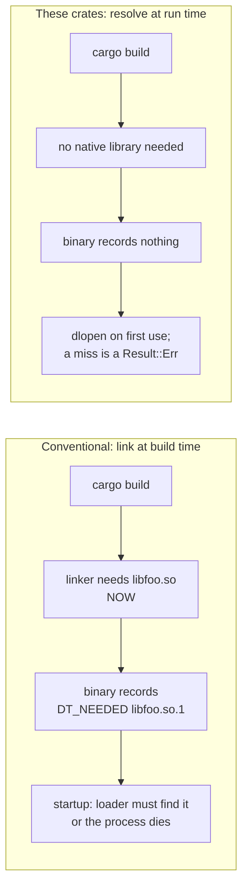

What that buys:

- The workspace builds with neither SDK installed.
- One binary runs on hosts with and without the runtime; a host lacking it gets a
  clean error instead of refusing to start.
- A deployment can swap runtime builds without recompiling.
- One binary can carry several backends and choose at startup.

The generated `extern "C"` blocks are therefore reference material only —
transcription targets for the `libloading` signatures. Neither crate calls them,
which is why the test binaries link with no native library present at all.

## 7. Which name to ask for

`dlopen` takes a filename, and a Linux shared library has three.

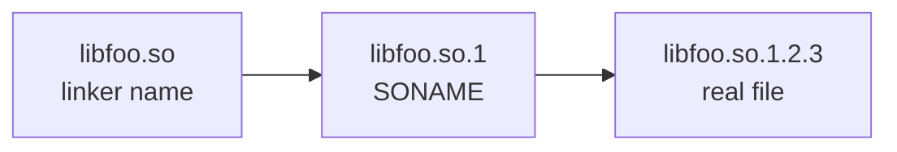

| Name | Role | Ask for it? |
|---|---|---|
| `libfoo.so` | linker name, used by `-lfoo` at build time; usually ships only in a `-dev` package | no — may be absent on a runtime-only host |
| `libfoo.so.1` | **SONAME**, recorded inside the ELF as `DT_SONAME`; the ABI version | **yes** |
| `libfoo.so.1.2.3` | one exact build | no — too specific |

The SONAME is the ABI contract: it bumps only on a breaking ABI change. Asking for
it picks up patch and minor upgrades for free while making it impossible to load
an incompatible ABI by accident. Both crates try the SONAME first and the bare
linker name only as a fallback.

## 8. The three-layer pattern

Generated code is never the public API. It sits at the bottom of three layers.

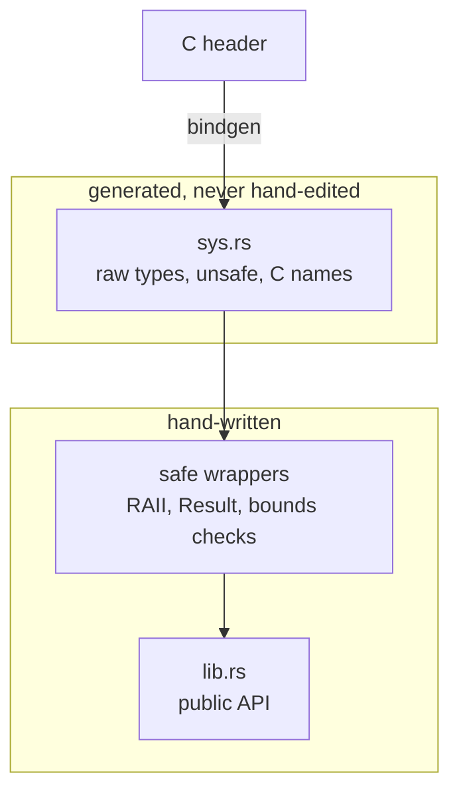

The middle layer is where the value is. It turns C conventions into Rust ones:

| C convention | What the safe layer does |
|---|---|
| return an error code | `Result<T, Error>` |
| caller must call `Release*` / `free` | `Drop` |
| `char*` with unclear ownership | `String`, copied |
| pointer + length | `&[T]`, length checked before the call |
| an integer that means an enum | a real Rust `enum` |
| handle valid only while its parent lives | `Arc`, so the order cannot be got wrong |

---

# Part II — `onnxrt-rs` (ONNX Runtime)

This crate is on the service's request path: `hushar` runs every inference
through it, so `libonnxruntime` is a run-time requirement of the service. It is
still not a *build* requirement of the workspace, which is the distinction
sections 5 and 6 are about.

## 9. Vendored header

The ONNX Runtime headers are MIT licensed, so they are **committed** to this
repository under `onnxrt-rs/headers/`. Regenerating therefore works offline, on
any machine, with no ONNX Runtime installed.

| | |
|---|---|
| Version | v1.29.0, `ORT_API_VERSION` 29 |
| Files | `onnxruntime_c_api.h`, `onnxruntime_ep_c_api.h`, `onnxruntime_error_code.h` |
| Licence | MIT, see `headers/LICENSE.onnxruntime` |

The allowlist cuts an 8737-line header down to bindings that describe only the
API:

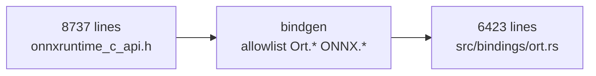

## 10. One symbol, then a table of function pointers

ONNX Runtime exports essentially **one** symbol. `bindgen` emits exactly one
`extern "C"` function for the whole API. Everything else is reached through a
struct of function pointers.

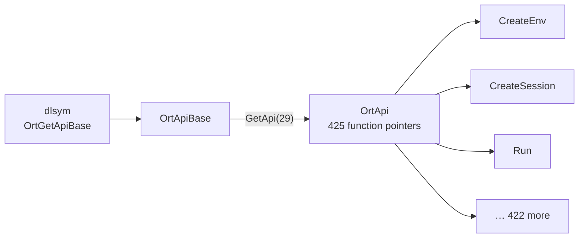

So the whole runtime costs a single `dlopen` plus a single `dlsym`. The returned
`&'static OrtApi` is cached in a `OnceLock`, and `Api` is a `Copy` handle to it.

This design is also how version negotiation happens: `GetApi(29)` asks for a
specific API version, and a runtime too old to provide it returns null rather than
something subtly wrong.

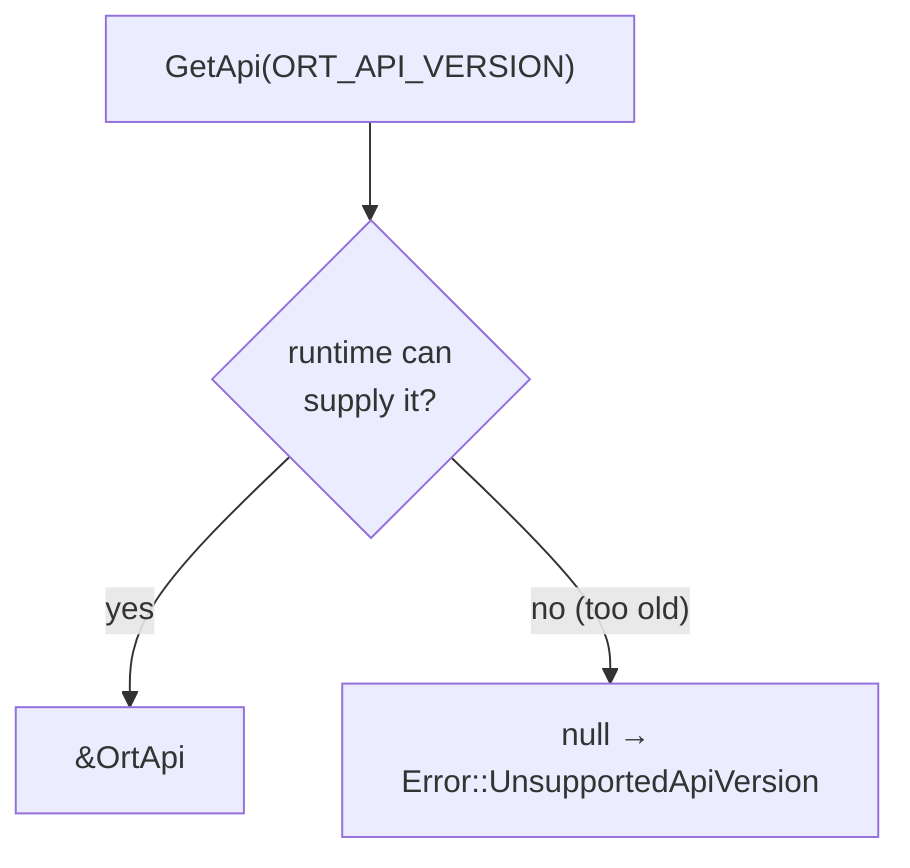

## 11. Resource ownership

Every ONNX Runtime handle has a matching `Release*`. Each is owned by a Rust type
whose `Drop` calls it, so nothing leaks on an early return or a panic.

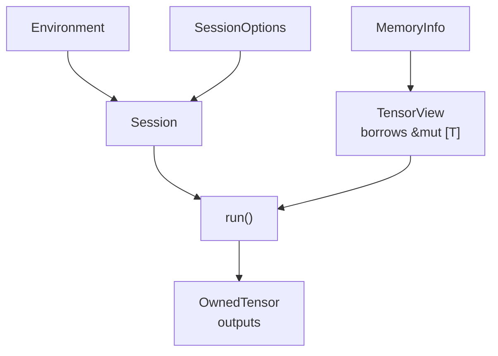

`Session` is `Send + Sync`: ONNX Runtime documents concurrent `Run` on a shared
session as needing no external synchronisation
([microsoft/onnxruntime#114](https://github.com/microsoft/onnxruntime/issues/114)),
so an `Arc<Session>` serves requests from many threads directly. That is covered
by an 8-thread test.

## 12. Verified

| Claim | Status |
|---|---|
| bindings match the header | 36 compile-time layout assertion blocks |
| committed == regenerated | byte-identical, checked on macOS arm64 and Linux x86-64 |
| loads by SONAME with no env var | verified on Linux, versioned name only |
| clean error when absent | verified, including the real reason from `dlerror` |
| real inference, single and batch | verified against ONNX Runtime 1.29.0 |
| concurrent use of one session | verified, 8 threads |

---

# Part III — `libnrt-rs` (AWS Neuron)

## 13. Headers deliberately not vendored

Unlike ONNX Runtime's MIT licence, the Neuron SDK headers ship as
`Copyright Amazon.com, Inc. All Rights Reserved`, so they are **not** committed
here. `headers/wrapper.h` is our own file that merely includes them from the SDK
on the build host.

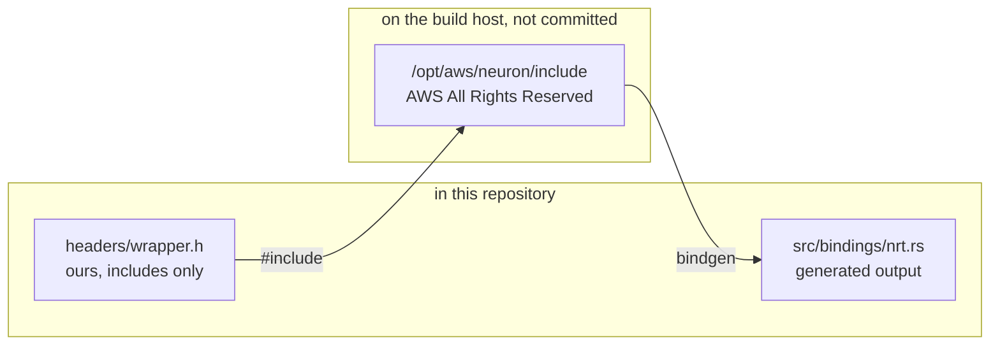

Override the location with `NEURON_INCLUDE_DIR`. Bindings were generated from
`aws-neuronx-runtime-lib` 2.34.10.0.

## 14. Flat symbols, resolved by name

Where ONNX Runtime exports one symbol, libnrt exports its functions as ordinary
symbols — `bindgen` emits 67 `extern "C"` declarations. Each one the crate needs
is looked up individually.

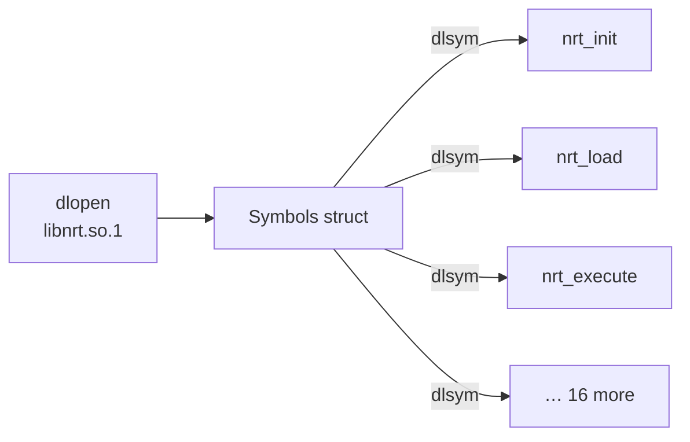

19 symbols are resolved, eagerly and once, out of the 133 `nrt_*` the library
exports. All 19 were verified present in the real `libnrt.so`. Note the SONAME is
`libnrt.so.1` while the file is `libnrt.so.2.34.10.0` — the product version moves
independently of the ABI revision.

## 15. The `linux/types.h` shim

The Neuron headers share structs with the kernel driver, so they reach into
`<linux/types.h>` — a file that does not exist off Linux. Without help the
bindings could only ever be regenerated on Linux.

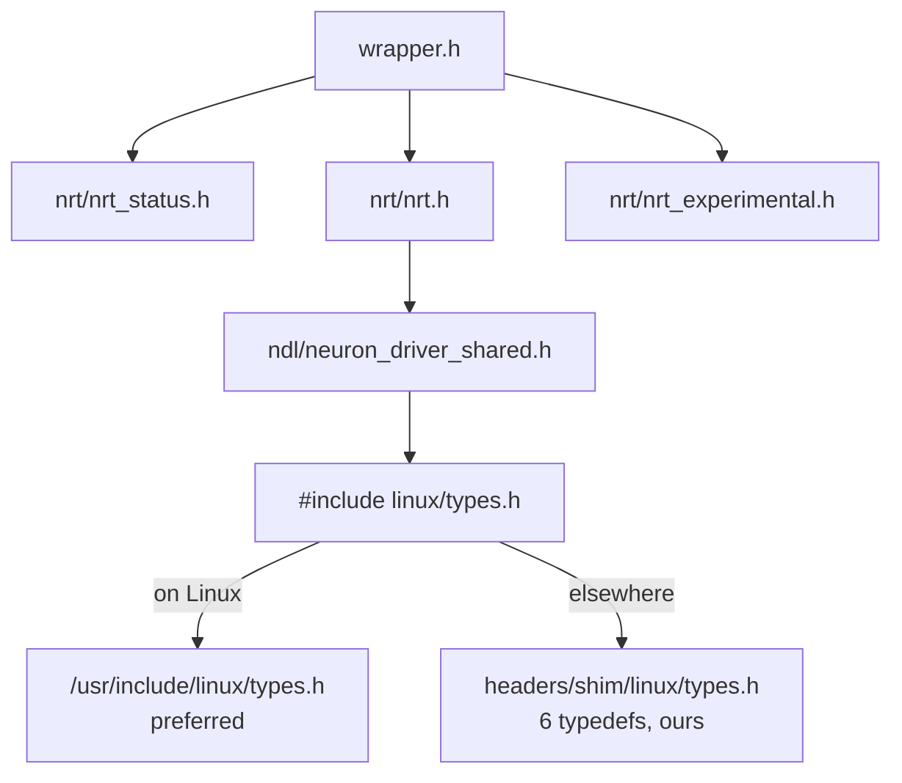

The shim is wired in with `-idirafter`, so it is searched *after* every real
include path and a genuine Linux host always wins. The difference is small,
measured, and worth knowing:

| | macOS arm64 (shim) | Linux x86-64 (real) |
|---|---|---|
| `__u32` | `u32` | `c_uint` |
| `__u64` | `u64` | `c_ulonglong` |

Same size, alignment, and signedness, so both are layout-correct — 4 lines of
6423 differ and nothing else does. The Linux form is the faithful one, so that is
what is committed.

One more wrinkle: `nrt_get_model_tensor_info`, the only way to discover a NEFF's
tensor names and shapes, lives in `nrt_experimental.h`. The crate depends on it
and inherits that status.

## 16. Lifecycle enforced by `Arc`

`nrt_init` and `nrt_close` are process-global, and closing the runtime while a
model is still loaded is undefined behaviour. Rather than documenting that,
`Runtime` is handed out as an `Arc` that every dependent object holds a clone of,
so reference counting makes the correct teardown order the only reachable one.

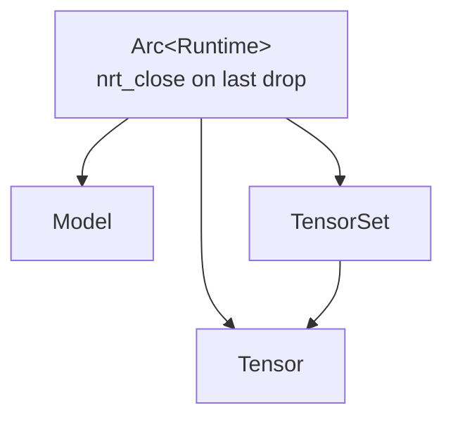

A second `nrt_init` in one process is reported as `Error::AlreadyInitialized`
instead of corrupting shared state.

## 17. Verified — and the gap

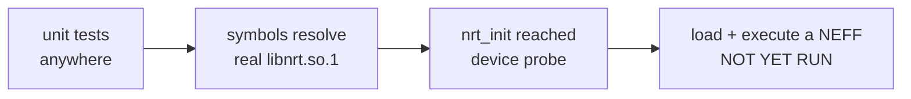

| Claim | Status |
|---|---|
| bindings match the header | 15 compile-time layout assertion blocks |
| committed == regenerated | byte-identical on Linux x86-64 |
| all 19 symbols resolve | verified against real `libnrt.so.1` |
| `nrt_init` reaches the device probe | verified; returns `NRT_INVALID` with no device |
| clean error off Linux | verified, `UnsupportedPlatform` |
| **load a NEFF, allocate, execute** | **not verified — needs Inf2 / Trn1** |

Loading and symbol resolution are proven. Everything past that point is reviewed
against the SDK headers but has never run. Treat it accordingly until it does.

---

# Regenerating either crate

```bash
# ONNX Runtime: header is vendored, so this works offline anywhere.
cargo build -p onnxrt-rs --features bindgen

# Neuron: needs the SDK headers on the host.
NEURON_INCLUDE_DIR=/opt/aws/neuron/include \
  cargo build -p libnrt-rs --features bindgen

# Then diff against what is committed.
diff <(tail -n +9 onnxrt-rs/src/bindings/ort.rs) \
     "$(find target -name bindings.rs -path '*onnxrt-rs*' | head -1)"
```

**`rustfmt` must be installed** or that diff is worthless. `bindgen` shells out to
it and only *warns* when it is missing, then emits the entire binding on two
enormous lines — valid Rust, but every line reports as changed. The official
`rust:*-bookworm` images do not ship it; `rustup component add rustfmt` fixes it.

## Version numbers

Four distinct versions are in play. They are not interchangeable.

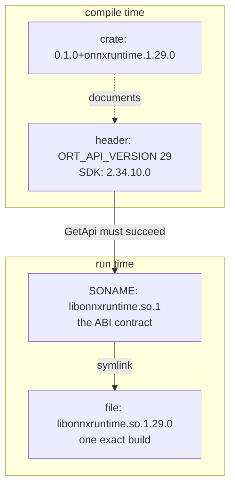

- **Header / SDK version** — what the committed bindings came from. Exposed as
  `BINDINGS_RUNTIME_VERSION` and `BINDINGS_SDK_VERSION`.
- **Crate version** — the Rust API's own SemVer. The upstream release is build
  metadata after `+`, which SemVer ignores when comparing, so it documents the
  pairing without constraining resolution.
- **SONAME** — the ABI version, and what gets looked up.
- **File version** — one exact build.

Compile-time and run-time versions can legitimately differ, since the library is
resolved at run time. Report both when diagnosing:

```rust
println!("built against {}, running {}",
         onnxrt_rs::BINDINGS_RUNTIME_VERSION, api.version());
```

## Further reading

- [bindgen user guide](https://rust-lang.github.io/rust-bindgen/)
- [`libloading`](https://docs.rs/libloading/)
- [Rust FFI reference](https://doc.rust-lang.org/nomicon/ffi.html)
- [`onnxrt-rs/README.md`](../onnxrt-rs/README.md),
  [`libnrt-rs/README.md`](../libnrt-rs/README.md)
