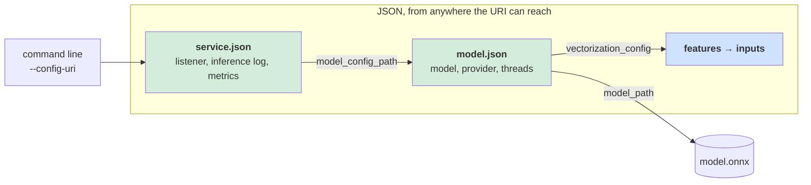
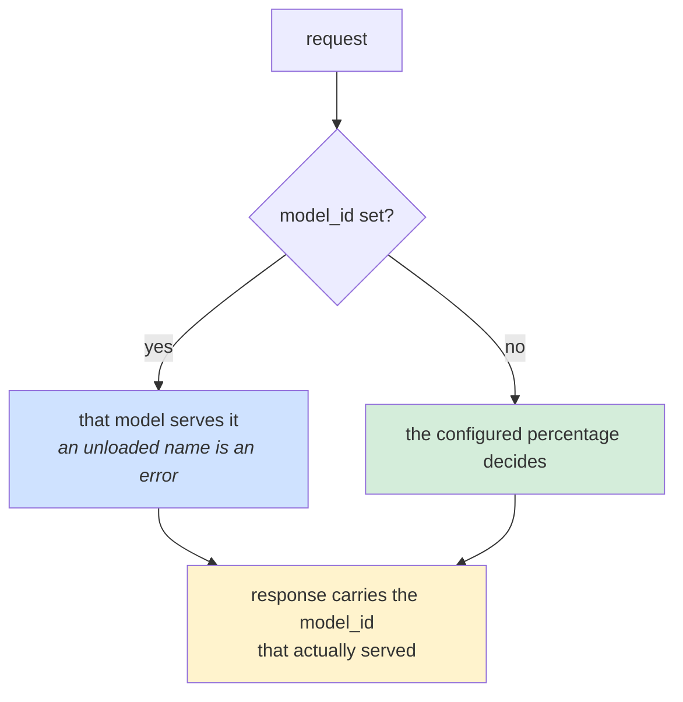
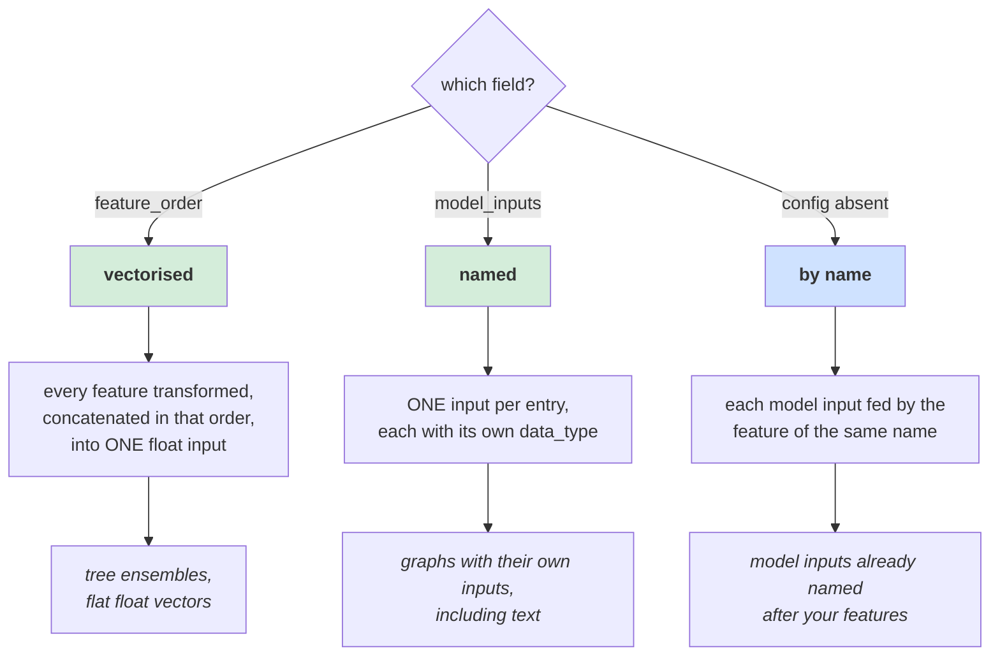
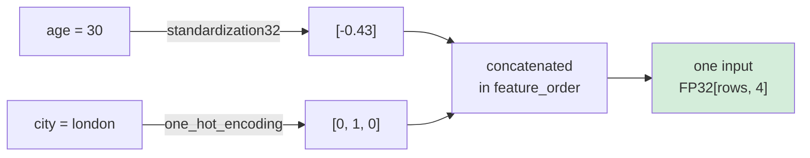
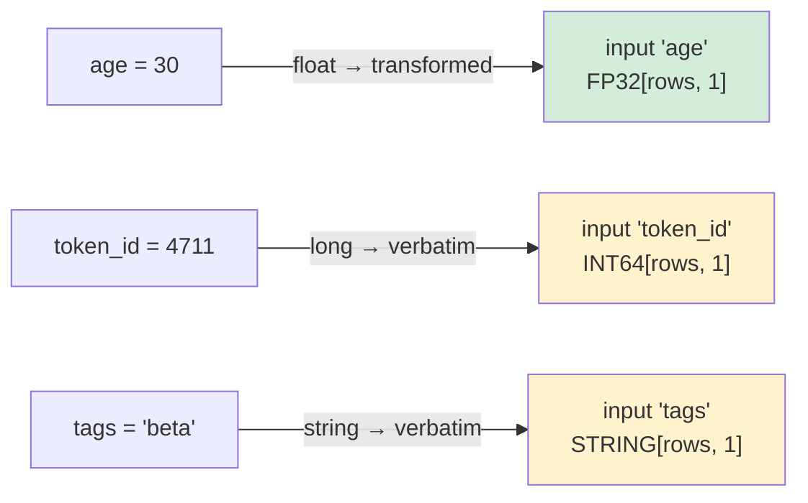
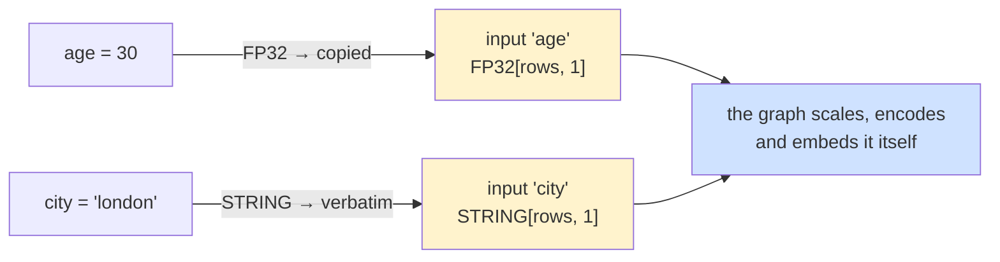
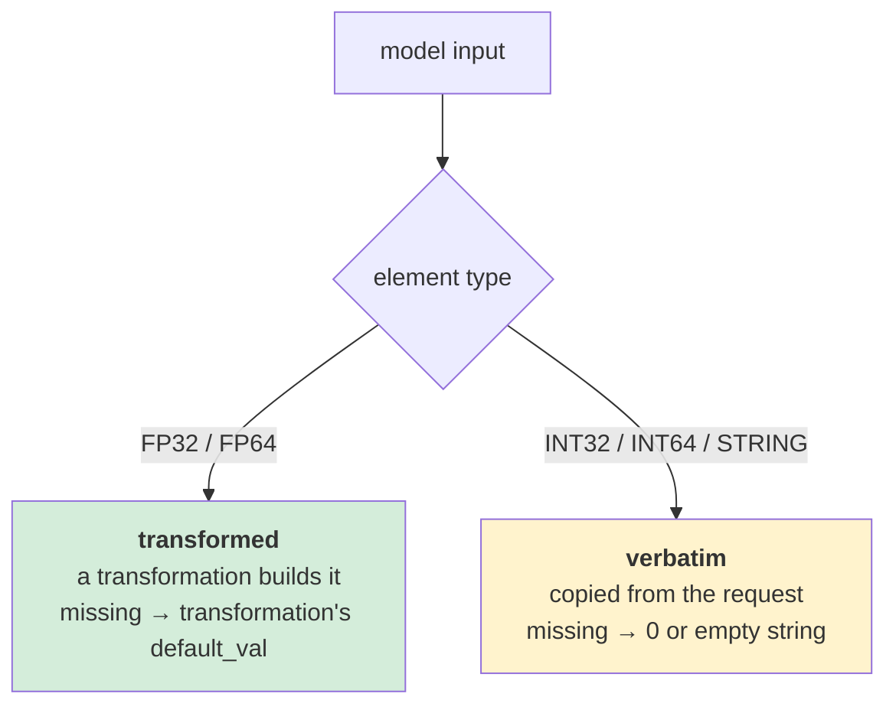
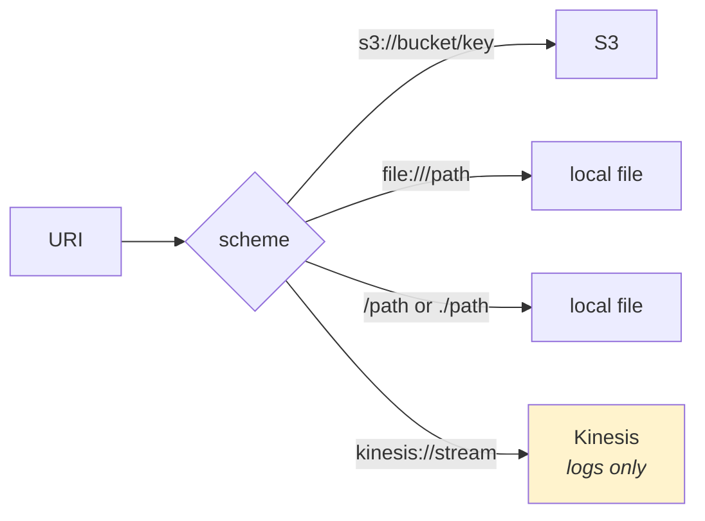
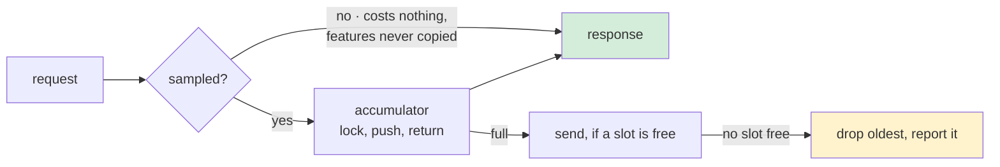

# Configuration

Two JSON files and one flag that says where the first of them is. The files describe
**everything**: what to serve, and where this process reads and writes.



Both files use `deny_unknown_fields`: a misspelled key is a startup failure naming the
key, not a setting that silently does nothing.

---

## service.json

Everything true of the process rather than of the model. Two fields are required — what
to serve, and where to record what it did.

| Field | Type | Default | Meaning |
|---|---|---|---|
| `model_config_path` | string | **required** | URI of the model configuration — the control |
| `inference_log` | object | **required** | where inference logs go — below |
| `threading` | object | *one per core* | thread counts and core placement — below |
| `candidate_model` | object | *none* | a second model and its traffic share — below |
| `bind_address` | IP | `0.0.0.0` | IPv4 or IPv6 to bind; `--bind-address` overrides |
| `port_number` | u16 | `8279` | port to serve gRPC on; `--port` overrides |
| `metrics` | object | *stderr* | where timings go — below |

### `inference_log`

| Field | Type | Default | Meaning |
|---|---|---|---|
| `uri` | string | **required** | prefix to write under, or `kinesis://stream` |
| `batch_size` | usize | `5000` | batches held before a write |
| `sample_rate` | f64 | `1.0` | fraction of requests logged, `0.0..=1.0` |
| `max_sends_in_flight` | usize | `4` | writes allowed at once before shedding |

### `candidate_model`

A roll-out: `model_config_path` is the **control**, this is the **candidate**, and
`traffic_percent` is the share the candidate serves. Omit the block to serve one model.

| Field | Type | Default | Meaning |
|---|---|---|---|
| `config_path` | string | **required** | the candidate's own model configuration |
| `traffic_percent` | u8 | **required** | whole percent `0..=100` the candidate serves |

```json
{
  "model_config_path": "s3://models/fraud-v3/model.json",
  "candidate_model": {
    "config_path": "s3://models/fraud-v4/model.json",
    "traffic_percent": 10
  },
  "inference_log": { "uri": "s3://my-bucket/inference-logs" }
}
```

```
hushar: model fraud-v3 loaded on onnxruntime/CPU (runtime 1.29.0)
hushar: candidate model fraud-v4 loaded on onnxruntime/CPU (runtime 1.29.0)
hushar: A/B roll-out -> control fraud-v3 keeps the rest, candidate fraud-v4 takes 10% of traffic
```

Only the candidate's share is stated, because that is how a roll-out is described — "ten
percent on the new model" — and two numbers could contradict each other. `0` loads the
candidate and sends it nothing, which is how you prove it loads before it serves anyone;
`100` is the end of the roll-out.

**Two ways a model gets chosen.**



A request naming a model in `InferenceRequest.model_id` overrides the split. That is for a
caller that already decided — the experiment bucket a user belongs to — so the two
decisions cannot disagree. A name the server has not loaded is **refused**, naming both
loaded models, rather than falling back: a request quietly served by the other arm would
answer correctly while corrupting the comparison it belongs to.

The response always carries the `model_id` that served it. Without it a caller cannot
attribute an outcome to an arm, which is the point of a split.

**The split is exact but not sticky.** The candidate's share is delivered per hundred
requests rather than in expectation, and the requests are spread through each hundred
rather than taken from the front — so the arms cannot correlate with anything periodic in
the arrival pattern. But the arm depends on arrival order, not on the request, so the same
caller asking twice may be served by both. An experiment that needs a subject held to one
arm has to decide on its own side and name the model.

**Each arm carries its own `vectorization_config`,** so the candidate may take its features
differently from the control — one vectorized and one named is expressible, because a
request is named values rather than a tensor. The request then has to carry the features
**both** arms need.

⚠️ Both models are resident, so memory is the sum of the two. Two 100M-parameter models
are roughly 760 MB of weights before anything else.

**Timings are separated by model.** `metrics` gains a `ModelId` dimension on CloudWatch,
and the stderr summary names the model on every line, with the interval counted per model
so each arm's line covers the same number of batches. Averaging the arms together would
hide the difference the roll-out exists to measure.

### `threading`

How the process spends the host's cores, and how much it lets in. Counts decide how much
runs at once; the two core lists decide where those threads run.

| Field | Type | Default | Meaning |
|---|---|---|---|
| `connection_concurrency` | u16 | `500` | in-flight requests admitted **per connection** — admission, not work |
| `worker_threads` | usize | *one per core* | tokio async workers; these never run inference |
| `inference_concurrency` | usize | *one per core* | concurrent inferences, and the queue in front of the engine |
| `intra_op_threads` | i32 | `1` | ONNX Runtime threads inside one operator, **caller included**. `0` leaves the runtime's default |
| `worker_cores` | string | *unpinned* | logical CPUs the async pool may use, as `"0-1"` or `"0,2,4"` |
| `compute_cores` | string | *unpinned* | logical CPUs the inference threads may use, as `"2-9,12"` |
| `allow_spinning` | bool | *runtime default* | whether idle ONNX Runtime threads spin waiting for work |
| `sessions_per_model` | usize | `1` | independent sessions per model, each with its own intra-op pool pinned to its own core slice. There are `sessions_per_model` slices, not `models × sessions_per_model` — replica `i` of every model shares slice `i`. Costs one copy of the weights per session |

```json
{
  "model_config_path": "model.json",
  "threading": {
    "worker_threads": 2,
    "inference_concurrency": 8,
    "intra_op_threads": 1,
    "worker_cores": "0-1",
    "compute_cores": "2-9"
  },
  "inference_log": { "uri": "./logs" }
}
```

```
hushar: threads -> 2 async, 8 inference x 1 intra-op x 1 session(s) = 8 compute on 10 core(s)
  admit  : 500 in flight per connection
  cores  : async on core(s) 0-1, compute on core(s) 2-9
```

Six things to know before setting any of them:

- **Admission is not work.** `connection_concurrency` bounds how many requests one
  connection may have in flight, as a tower limit and as HTTP/2's `MAX_CONCURRENT_STREAMS`.
  What it admits queues for a blocking thread rather than taking a core, so
  `inference_concurrency` is the number that decides CPU. It bounds **one connection**, not
  the process — ten connections admit ten times it — which is why the default is a flat 500:
  derived from the cores, it made a single-connection client the ceiling on a large host.
  Nothing here caps total in-flight requests, so overload shows as latency rather than
  rejection.
- **The counts add per session, they do not multiply per request.** The CPU load is
  `inference_concurrency + sessions × (intra_op_threads − 1)`, where `sessions` is
  `models × sessions_per_model` — the intra-op pool belongs to the session, not to the
  caller and not to the process. So `inference_concurrency: 2` with `intra_op_threads: 4`
  and one model is **5** compute threads, not 8. The banner prints the sum against the core
  count and says so when it is above *or* far below it.
- **One session shares one pool.** Every concurrent request to a model queues for that
  model's single intra-op pool, so latency rises with load even on an idle host. More slots
  give each in-flight request a pool of its own — see
  [threads-and-cores.md](threads-and-cores.md#start-here) for the sizing rule.
- **A second resident model is not free, and it is not a threading mistake.** Sessions
  scale with the model count but slices do not, so each slice gains a pool without gaining
  a core. Measured at saturation, dropping the candidate made the service **20 % faster**
  at p50. With
  `intra_op_threads: 1` and `mini_batch_size` set, the model count leaves the arithmetic and
  the gap falls under 3 % — see
  [Two models on one host](threads-and-cores.md#two-models-on-one-host).
- **These do not create throughput.** The work in a request is fixed; the settings choose
  whether the parallelism goes *across* requests or *within* one. High
  `inference_concurrency` with `intra_op_threads: 1` favours requests per second; the
  reverse favours per-request latency. The middle gets neither.
- **Rows per request matters more.** Each `Run()` call carries a fixed cost independent of
  the row count, so batching is what raises the ceiling. Thread settings only move latency
  around.
- **Core lists are Linux.** They are accepted everywhere and applied on Linux; elsewhere the
  banner says `NOT APPLIED`, because macOS thread affinity is advisory.

→ [**threads-and-cores.md**](threads-and-cores.md) for the reasoning, the accelerator case,
and how the affinity string is derived.
→ [**benchmark-data/results**](../benchmark-data/results/index.md) for what any of it
measures on real hardware.

Bad values are refused at startup: a zero thread count, a negative `intra_op_threads`, or a
core list that will not parse — each naming the field and, for a list, the offending
fragment.

### `metrics`

Omit the whole object to summarise timings to stderr, which is what a local run wants and
needs no credentials.

| Field | Type | Default | Meaning |
|---|---|---|---|
| `cloudwatch_namespace` | string | *unset* | publish here; unset means stderr |
| `batch_size` | usize | `500` | scored batches per send, and per stderr line |
| `max_sends_in_flight` | usize | `4` | sends allowed at once before shedding |

```json
{
  "bind_address": "0.0.0.0",
  "port_number": 50051,
  "model_config_path": "s3://my-bucket/models/fraud-v3/model.json",

  "inference_log": {
    "uri": "s3://my-bucket/inference-logs",
    "batch_size": 5000,
    "sample_rate": 0.01,
    "max_sends_in_flight": 4
  },

  "metrics": {
    "cloudwatch_namespace": "HusharService",
    "batch_size": 500,
    "max_sends_in_flight": 4
  }
}
```

The shortest configuration that starts is two lines:

```json
{ "model_config_path": "model.json", "inference_log": { "uri": "./logs" } }
```

**Why `inference_log` is required.** Recording nothing is a decision, not a default. Every
other field has a sensible answer if you say nothing; where a service writes what it
predicted does not.

**Why `threading` is left out above.** Every field in it has a default, and the two that
usually matter move together — how many inferences run at once, and how many requests a
connection may have in flight. Omitted, the banner reports what it chose:

```
hushar: threads -> 8 async, 8 inference x 1 intra-op x 1 session(s) = 8 compute on 8 core(s)
  admit  : 500 in flight per connection
```

⚠️ **`connection_concurrency` bounds one connection, not the process.** Ten connections
admit ten times the limit. Nothing in the service caps total in-flight requests; beyond
`inference_concurrency` they queue, so overload shows as latency rather than rejection.
The number is a flat 500 rather than a multiple of the cores because it is admission and
not work: sized from the cores, it made a single-connection client — one tonic `Channel`
is one HTTP/2 connection — the ceiling on a large host.

**Why the two objects are nested.** `batch_size` means a different thing in each — 500
batches of timings against 5000 requests' worth of feature maps — and so does
`max_sends_in_flight`, which bounds memory as `batch_size × (n + 1)` in both. A flat
`metrics_batch_size` / `data_batch_size` pair only reads as parallel to someone who
already knows that.

## model.json

| Field | Type | Default | Meaning |
|---|---|---|---|
| `model_id` | string | **required** | name used in logs, metrics and the banner |
| `model_path` | string | **required** | URI of the `.onnx` file |
| `execution_provider` | string | `"cpu"` | which hardware — see [hardware.md](hardware.md) |
| `mini_batch_size` | usize | *unset* | split a request's rows into batches of this many, scored together |
| `is_fixed` | bool | `false` | pad the last batch to `mini_batch_size` — set only if the graph pins its row axis |
| `vectorization_config` | object | *unset* | how features become inputs — below |

```json
{
  "model_id": "fraud-v3",
  "model_path": "s3://my-bucket/models/fraud-v3/model.onnx",
  "execution_provider": "cpu",
  "vectorization_config": { "feature_order": ["age", "city", "amount"] }
}
```

**Thread counts are not here.** `intra_op_threads` moved to
[`threading`](#threading) in `service.json`: it describes how a host spends its cores
rather than anything about the model, and a roll-out's two arms must share it or the
comparison measures thread counts instead of models. A `model.json` still naming it is
refused rather than ignored.

**`mini_batch_size` does not constrain callers.** A request of any size is served: its rows
are cut into batches of this many and **scored at the same time**, one scoped thread each.
Splitting raises the parallelism one request can use, which is the only way to get below the
latency floor a single batch imposes — measured at 50 rows, p95 fell 18.45 → 14.38 ms at the
same CPU. See [threads-and-cores.md](threads-and-cores.md#the-five-layers).

It pairs with `intra_op_threads`, and you want one or the other: a split request spreads
across its session's core slice by itself, so set `intra_op_threads: 1` when splitting.
Finer is not better — each batch re-reads the whole model, so past a point memory bandwidth
costs more than the parallelism gains.

**`is_fixed` is only for a pinned graph.** By default the last batch is short and is scored
at its true size. `is_fixed: true` pads it to `mini_batch_size` instead, then discards the
padding — which a model exported with a pinned row axis needs in order to be served at all.
Setting it without a size is refused; so is a pinned graph without it.

---

## vectorization_config

The request carries `{"age": 30, "city": "london"}`. The model wants tensors. This is the
bridge, and the field you set decides which of three shapes it takes.



Setting both `feature_order` and `model_inputs`, or neither while the object is present,
is a startup failure.

### Shape 1 · vectorised

```json
"vectorization_config": {
  "data_type": "float",
  "feature_transformations": {
    "age":  { "type": "standardization32", "mean": 35.5, "std_dev": 12.8, "default_val": [0.0] },
    "city": { "type": "one_hot_encoding", "categories": ["berlin", "london", "paris"], "default_val": [0, 0, 0] }
  },
  "feature_order": ["age", "city"]
}
```



| Field | Default | Meaning |
|---|---|---|
| `feature_order` | — | features to concatenate, **in this order** |
| `data_type` | `"float"` | `float` or `double` for the single input |
| `feature_transformations` | `{}` | per-feature transformation; a feature listed with no entry gets `identity` |

`data_type: "double"` exists for tree ensembles: a value nudged across a split by a
narrowing cast does not shift a prediction slightly, it selects a different leaf.

### Shape 2 · named

```json
"vectorization_config": {
  "feature_transformations": {
    "age": { "type": "standardization32", "mean": 35.5, "std_dev": 12.8, "default_val": [0.0] }
  },
  "model_inputs": {
    "age":      { "data_type": "float" },
    "token_id": { "data_type": "long" },
    "tags":     { "data_type": "string" }
  }
}
```



Each key is both a model input name **and** the feature name that feeds it.

### Shape 3 · by name

Omit `vectorization_config` entirely. Every model input is fed by the feature of the same
name, typed from the model's own signature. Nothing to write, nothing to keep in sync.

```json
{
  "model_id": "fraud-v3",
  "model_path": "s3://my-bucket/models/fraud-v3/model.onnx"
}
```



This is the shape for a model that was **trained with its featurization inside it**, which
most are: the scaling constants, category lists and embedding tables live with the weights
they were fitted against, so there is no second artefact to version and no configuration
that can disagree with the graph. A float input is still built by a transformation — an
identity one, sized from the model — so an absent feature fills its row with zeros rather
than making the batch ragged.

`benchmark-data/generated/bench_raw_model_config.json` is a worked example: 212 features,
four lines of configuration. See [benchmarking.md](benchmarking.md) for what it costs
against the same model fed the vectorised way.

---

## The float rule

One rule decides whether an input is transformed or copied, and it is read off the
input's element type rather than configured separately:



Both routes refuse a variant they cannot take, rather than converting it. A float sent to
an `INT64` input is refused, not rounded; a number sent to a text input is refused, not
stringified; a `double_value` sent to a `standardization32` feature is refused, not
narrowed. Converting quietly would turn a configuration mistake into a wrong prediction.
The one widening allowed is lossless: an `INT64` input accepts an integer as well as a
long. An `INT32` input does not accept a long.

Transformations are defined in `f32`, which is why they only build float inputs —
rounding one into an integer, or inventing text from one, would be silent corruption.

---

## Transformations

Every transformation carries `default_val`, used when the feature is absent — and
**`default_val.len()` is what declares the input's width**, for all of them, checked
against the model at startup.

The `32` / `64` suffix is not a precision preference, it is which **wire variants** the
transformation accepts. They are exact complements, so a client sending a protobuf
`double_value` to a `standardization32` feature is refused for that request.

| `"type"` | Parameters | Accepts | Width should be |
|---|---|---|---|
| `identity` | — | any variant: numbers, arrays, booleans, and numeric strings | as many values as you send |
| `standardization32` | `mean`, `std_dev` (f32) | `float`, `int`, and their arrays | 1 per value |
| `standardization64` | `mean`, `std_dev` (f64) | `double`, `long`, and their arrays | 1 per value |
| `min_max_scaling32` | `min`, `max` (f32) | `float`, `int`, and their arrays | 1 per value |
| `min_max_scaling64` | `min`, `max` (f64) | `double`, `long`, and their arrays | 1 per value |
| `one_hot_encoding` | `categories` (**sorted** strings) | `string`, `string_array` | `categories.len()` |
| `embedding` | `embeddings` (text → vector) | `string`, `string_array` | the vector length |

```json
{ "type": "embedding",
  "embeddings": { "good": [0.9, 0.4, -0.2], "poor": [-0.8, -0.3, 0.1] },
  "default_val": [0.0, 0.0, 0.0] }
```

> ⚠️ **`categories` must be sorted.** The lookup is a binary search, so an unsorted list
> makes a category that *is* present fall through to `default_val` — a wrong prediction
> with no error. Nothing checks this for you.

The `64` variants are not the `32` ones widened — `identity` and both 64-bit scalers do
their arithmetic in `f64` directly.

Already have a vector? Send it as one feature holding a `FloatArray` and give it
`identity`. Nothing is recomputed, and there is still only one request shape.

---

## Data types

Feature values on the wire are a protobuf `oneof`, so a value cannot claim two types.
`model_inputs` entries name what an input expects:

| `data_type` | Element type | Values per row | Built by |
|---|---|---|---|
| `float` / `float_array` | FP32 | 1 / many | transformation |
| `double` / `double_array` | FP64 | 1 / many | transformation |
| `int` / `int_array` | INT32 | 1 / many | verbatim |
| `long` / `long_array` | INT64 | 1 / many | verbatim |
| `string` / `string_array` | STRING | 1 / many | verbatim |

The scalar and array spellings differ only in expected width, and that is the point:
`float` declares one value per row, so a transformation producing five is caught at
startup rather than working until a one-hot encoding gains a category.

---

## Command line

Three options, and two of them are overrides. Everything else is in `service.json`,
because a setting that describes a deployment belongs in the file that describes the
deployment — and that file can live in S3 beside the model, versioned with it.

| Flag | Env | Default | Meaning |
|---|---|---|---|
| `--config-uri` | `HUSHAR_CONFIG_URI` | **required** | where `service.json` lives |
| `--port` | `HUSHAR_PORT` | *from config* | override `port_number` |
| `--bind-address` | `HUSHAR_BIND_ADDRESS` | *from config* | override `bind_address` |

`--config-uri` cannot move into the file, since it says where the file is. The other two
stay because running two instances on one machine is a developer concern, and neither is
the source of truth: absent, the configured value is used.

Both are also environment variables, so a container is configured from the environment
and a developer from flags.

### Moved into `service.json`

| Was | Is now |
|---|---|
| `--inference-log-uri` | `inference_log.uri` |
| `--data-batch-size` | `inference_log.batch_size` |
| `--data-sample-rate` | `inference_log.sample_rate` |
| `--cloudwatch-namespace` | `metrics.cloudwatch_namespace` |
| `--metrics-batch-size` | `metrics.batch_size` |
| `--max-sends-in-flight` | `inference_log.max_sends_in_flight` **and** `metrics.max_sends_in_flight` |

The last one was a single knob over two sinks whose memory profiles differ by an order of
magnitude; it is now one per sink. All six are refused if passed as flags, and refused if
placed at the top level of the JSON, so an upgrade fails naming the field rather than
silently ignoring it.

### URIs

The scheme picks the storage, so the same binary reads a local file in development and an
S3 object in production.



### What the observability levers cost



| Lever | Reach for it when | Costs |
|---|---|---|
| `inference_log.sample_rate` | log volume is the problem | nothing — the only lever that *removes* work |
| `inference_log.batch_size` | writes are too frequent | memory, roughly one batch of features |
| `inference_log.max_sends_in_flight` | the destination is bursty | memory: `batch_size × (this + 1)` records |

At the defaults a log sink holds up to 5000 × 5 = 25,000 batches, a few tens of megabytes
for a typical row — which is why sampling is the lever to reach for first. Caps apply per
destination: CloudWatch takes 1000 data points per call (3 per batch, so 333 batches) and
Kinesis 500 records, and the banner prints what was settled on rather than what was asked
for.

### Validation

`serde` establishes that the fields are present and of the right type;
`HusharServiceConfig::validate`, called from `from_json`, establishes that the numbers are
ones the process can honour. Values are **refused rather than clamped**, naming the field
and the range:

| Configured | Refused because |
|---|---|
| `"sample_rate": 10` | someone meant 10%, and reading it as "log everything" is the least likely intent |
| `"max_sends_in_flight": 0` | no slot for a send to start in |
| `"batch_size": 0` | nothing would accumulate; every send would be empty |
| `"threading.connection_concurrency": 0` | connections would be accepted and none answered — a hang, not an error |
| `"traffic_percent": 150` | not a share; it is the candidate's portion, so 0 to 100 |
| `"candidate_model": {"config_path": ""}` | remove the block to serve one model |
| `"cloudwatch_namespace": ""` | CloudWatch would reject it on the first publish, long after startup |

Clamping would be worse than refusing here because the startup banner prints these
numbers: a silently corrected value misreports the memory bound actually in force.

---

## What is checked, and when

```mermaid
flowchart TB
  subgraph boot["at startup — the server does not start"]
    direction TB
    b1["unknown JSON field"]
    b2["model input the config does not mention"]
    b3["config naming an input the model lacks"]
    b4["declared width ≠ what the transformation produces"]
    b5["transformation on a non-float input, or one nothing reaches"]
    b6["non-float model output, or a rank other than 1 or 2"]
    b7["provider absent from this build or this libonnxruntime"]
  end
  subgraph req["per request — that request fails"]
    direction TB
    r1["feature value of a variant the input<br/>cannot take — verbatim or transformed"]
    r2["rows of unequal width"]
    r3["output rows ≠ request rows"]
  end
  style boot fill:#d4edda
  style req fill:#fff3cd
```



An **absent** feature is not a failure on either side: a float input falls back to the
transformation's `default_val`, and a verbatim input to `0` or the empty string, repeated
to the input's width. A partial request still scores.

The split is the design: anything decidable from the model plus the configuration is a
**boot failure**, because a service that starts cleanly and then rejects every request is
worse than one that refuses to start.

| Check | Where it lives |
|---|---|
| unknown JSON field | `serde`, via `deny_unknown_fields` |
| both or neither config shape, transformation on a non-float input | [`VectorizationConfig::from_json`](../hushar/src/config/vectorization_config.rs) |
| non-float output, a rank other than 1 or 2, batch axis disagreement | [`convert_specs`](../hushar/src/inference/onnx_backend.rs) |
| undeclared input, missing input, type or width mismatch | [`InputBuilder::resolve`](../hushar/src/inference/input_builder.rs) |
| feature value of a variant the input cannot take, ragged row | [`InputBuilder::build`](../hushar/src/inference/input_builder.rs) |
| value count that is not whole rows | [`InputBatch::push`](../hushar/src/inference/batch.rs) |
| output rows ≠ request rows | [`run_batch`](../hushar/src/inference/scoring.rs) |
