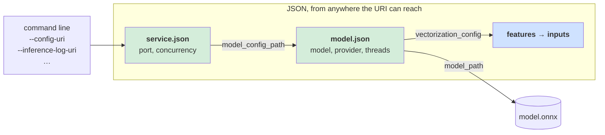
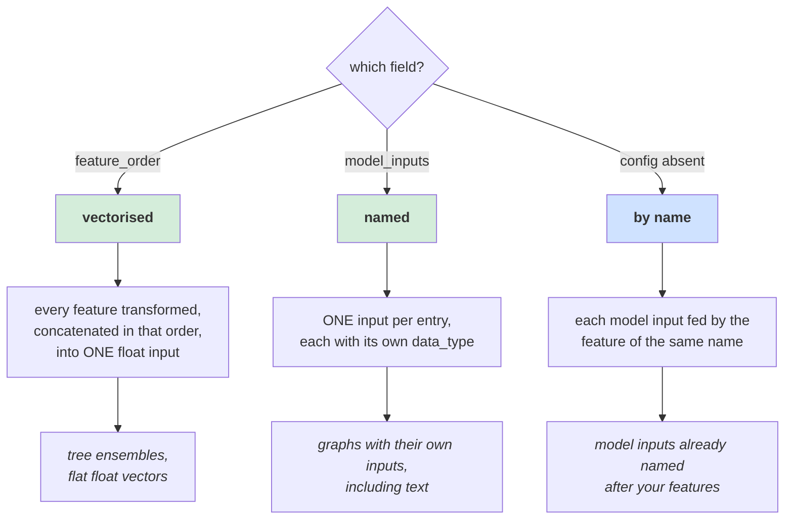
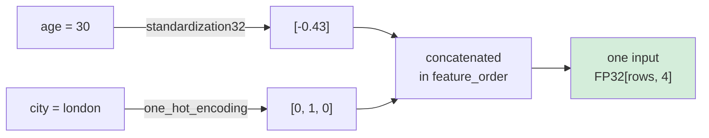
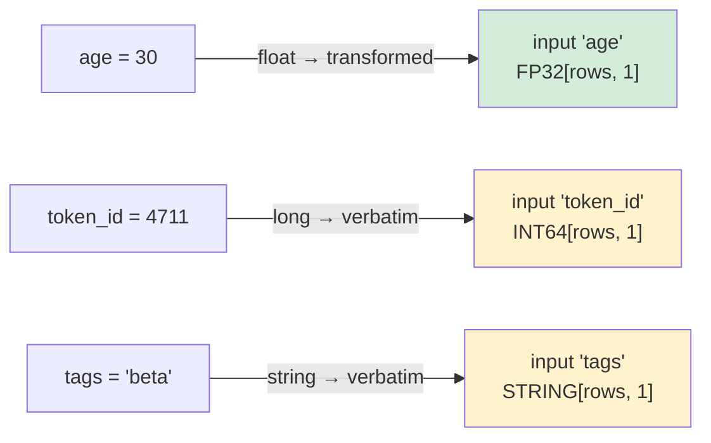
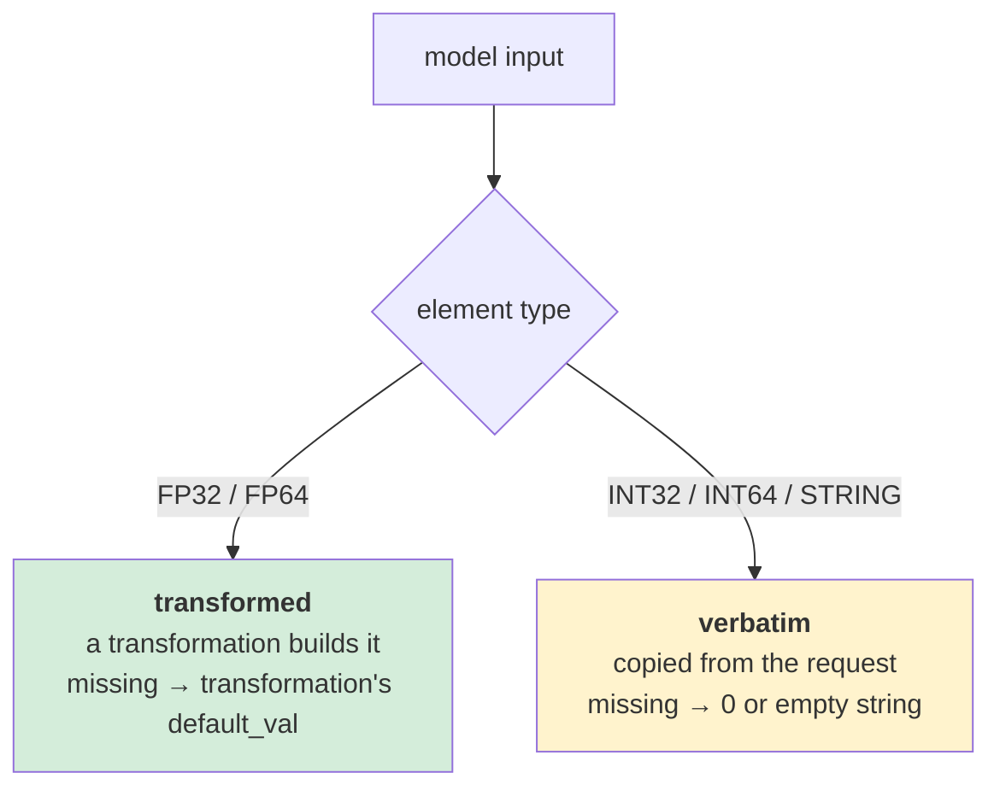
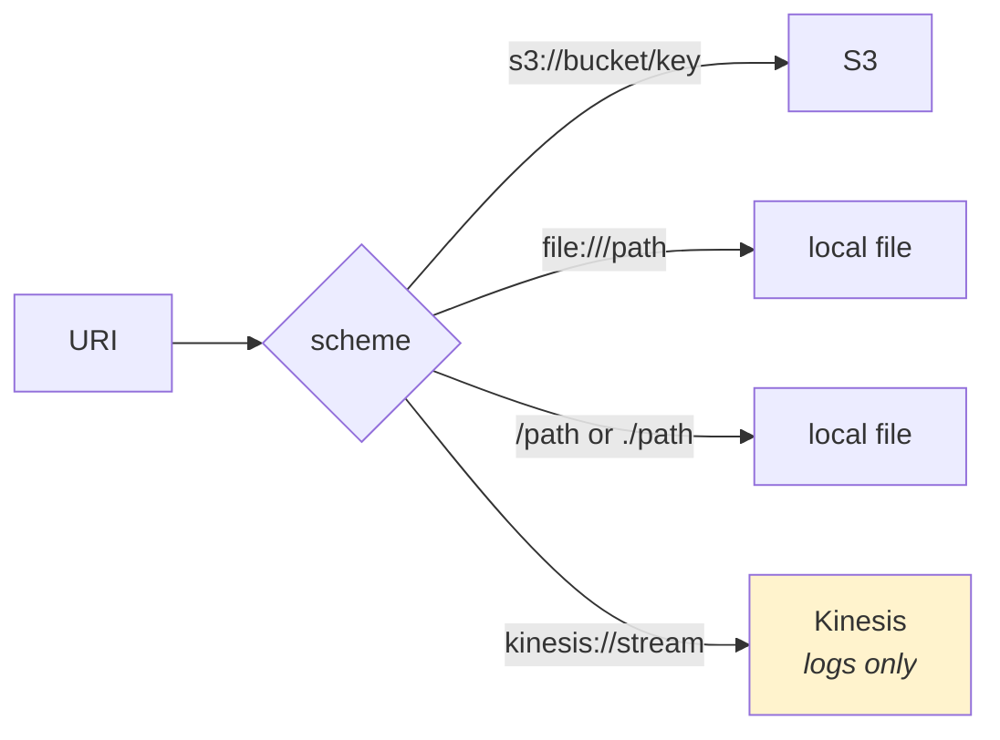
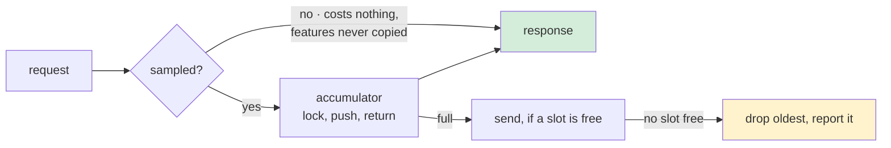

# Configuration

Two JSON files and a handful of flags. The files describe **what to serve**; the flags
describe **where this process reads and writes**.



Both files use `deny_unknown_fields`: a misspelled key is a startup failure naming the
key, not a setting that silently does nothing.

---

## service.json

| Field | Type | Default | Meaning |
|---|---|---|---|
| `model_config_path` | string | **required** | URI of the model configuration |
| `port_number` | u16 | `8279` | port to serve gRPC on |
| `connection_concurrency` | u16 | `50` | in-flight requests allowed per connection |

```json
{
  "port_number": 50051,
  "connection_concurrency": 50,
  "model_config_path": "s3://my-bucket/models/fraud-v3/model.json"
}
```

## model.json

| Field | Type | Default | Meaning |
|---|---|---|---|
| `model_id` | string | **required** | name used in logs, metrics and the banner |
| `model_path` | string | **required** | URI of the `.onnx` file |
| `execution_provider` | string | `"cpu"` | which hardware — see [hardware.md](hardware.md) |
| `intra_op_threads` | i32 | `1` | threads *inside* one operator |
| `fixed_batch_size` | usize | *unset* | set only if the graph pins its row axis |
| `vectorization_config` | object | *unset* | how features become inputs — below |

```json
{
  "model_id": "fraud-v3",
  "model_path": "s3://my-bucket/models/fraud-v3/model.onnx",
  "execution_provider": "coreml:cpu_and_neural_engine",
  "intra_op_threads": 1,
  "vectorization_config": { "feature_order": ["age", "city", "amount"] }
}
```

**`intra_op_threads` defaults to 1** because the service already saturates the machine
with concurrent requests; fanning a single operator across cores adds contention rather
than throughput. Raise it for a large model served at low concurrency.

**`fixed_batch_size` does not constrain callers.** A request of any size is served: rows
are cut into batches of this many and the last is padded, scored and discarded. It exists
so a model exported with a pinned row axis can be served at all. Pin near your real
traffic — one row against a size of 32 runs a batch of 32.

---

## vectorization_config

The request carries `{"age": 30, "city": "london"}`. The model wants tensors. This is the
bridge, and the field you set decides which of three shapes it takes.



Setting both `feature_order` and `model_inputs`, or neither while the object is present,
is a startup failure.

### Shape 1 · vectorised

```json
"vectorization_config": {
  "data_type": "float",
  "feature_transformations": {
    "age":  { "type": "standardization32", "mean": 35.5, "std_dev": 12.8, "default_val": [0.0] },
    "city": { "type": "one_hot_encoding", "categories": ["berlin", "london", "paris"], "default_val": [0, 0, 0] }
  },
  "feature_order": ["age", "city"]
}
```



| Field | Default | Meaning |
|---|---|---|
| `feature_order` | — | features to concatenate, **in this order** |
| `data_type` | `"float"` | `float` or `double` for the single input |
| `feature_transformations` | `{}` | per-feature transformation; a feature listed with no entry gets `identity` |

`data_type: "double"` exists for tree ensembles: a value nudged across a split by a
narrowing cast does not shift a prediction slightly, it selects a different leaf.

### Shape 2 · named

```json
"vectorization_config": {
  "feature_transformations": {
    "age": { "type": "standardization32", "mean": 35.5, "std_dev": 12.8, "default_val": [0.0] }
  },
  "model_inputs": {
    "age":      { "data_type": "float" },
    "token_id": { "data_type": "long" },
    "tags":     { "data_type": "string" }
  }
}
```



Each key is both a model input name **and** the feature name that feeds it.

### Shape 3 · by name

Omit `vectorization_config` entirely. Every model input is fed by the feature of the same
name, typed from the model's own signature. Nothing to write, nothing to keep in sync.

---

## The float rule

One rule decides whether an input is transformed or copied, and it is read off the
input's element type rather than configured separately:



Both routes refuse a variant they cannot take, rather than converting it. A float sent to
an `INT64` input is refused, not rounded; a number sent to a text input is refused, not
stringified; a `double_value` sent to a `standardization32` feature is refused, not
narrowed. Converting quietly would turn a configuration mistake into a wrong prediction.
The one widening allowed is lossless: an `INT64` input accepts an integer as well as a
long. An `INT32` input does not accept a long.

Transformations are defined in `f32`, which is why they only build float inputs —
rounding one into an integer, or inventing text from one, would be silent corruption.

---

## Transformations

Every transformation carries `default_val`, used when the feature is absent — and
**`default_val.len()` is what declares the input's width**, for all of them, checked
against the model at startup.

The `32` / `64` suffix is not a precision preference, it is which **wire variants** the
transformation accepts. They are exact complements, so a client sending a protobuf
`double_value` to a `standardization32` feature is refused for that request.

| `"type"` | Parameters | Accepts | Width should be |
|---|---|---|---|
| `identity` | — | any variant: numbers, arrays, booleans, and numeric strings | as many values as you send |
| `standardization32` | `mean`, `std_dev` (f32) | `float`, `int`, and their arrays | 1 per value |
| `standardization64` | `mean`, `std_dev` (f64) | `double`, `long`, and their arrays | 1 per value |
| `min_max_scaling32` | `min`, `max` (f32) | `float`, `int`, and their arrays | 1 per value |
| `min_max_scaling64` | `min`, `max` (f64) | `double`, `long`, and their arrays | 1 per value |
| `one_hot_encoding` | `categories` (**sorted** strings) | `string`, `string_array` | `categories.len()` |
| `embedding` | `embeddings` (text → vector) | `string`, `string_array` | the vector length |

```json
{ "type": "embedding",
  "embeddings": { "good": [0.9, 0.4, -0.2], "poor": [-0.8, -0.3, 0.1] },
  "default_val": [0.0, 0.0, 0.0] }
```

> ⚠️ **`categories` must be sorted.** The lookup is a binary search, so an unsorted list
> makes a category that *is* present fall through to `default_val` — a wrong prediction
> with no error. Nothing checks this for you.

The `64` variants are not the `32` ones widened — `identity` and both 64-bit scalers do
their arithmetic in `f64` directly.

Already have a vector? Send it as one feature holding a `FloatArray` and give it
`identity`. Nothing is recomputed, and there is still only one request shape.

---

## Data types

Feature values on the wire are a protobuf `oneof`, so a value cannot claim two types.
`model_inputs` entries name what an input expects:

| `data_type` | Element type | Values per row | Built by |
|---|---|---|---|
| `float` / `float_array` | FP32 | 1 / many | transformation |
| `double` / `double_array` | FP64 | 1 / many | transformation |
| `int` / `int_array` | INT32 | 1 / many | verbatim |
| `long` / `long_array` | INT64 | 1 / many | verbatim |
| `string` / `string_array` | STRING | 1 / many | verbatim |

The scalar and array spellings differ only in expected width, and that is the point:
`float` declares one value per row, so a transformation producing five is caught at
startup rather than working until a one-hot encoding gains a category.

---

## Command line

Every flag is also an environment variable, so a container is configured from the
environment and a developer from flags.

| Flag | Env | Default | Meaning |
|---|---|---|---|
| `--config-uri` | `HUSHAR_CONFIG_URI` | **required** | where `service.json` lives |
| `--inference-log-uri` | `HUSHAR_INFERENCE_LOG_URI` | **required** | prefix to write inference logs under |
| `--bind-address` | `HUSHAR_BIND_ADDRESS` | `0.0.0.0` | IPv4 or IPv6 to bind |
| `--port` | `HUSHAR_PORT` | *from config* | override `port_number`; for two instances on one machine |
| `--cloudwatch-namespace` | `HUSHAR_CLOUDWATCH_NAMESPACE` | *unset* | publish metrics here; unset means stderr |
| `--metrics-batch-size` | `HUSHAR_METRICS_BATCH_SIZE` | `500` | scored batches per metrics send |
| `--data-batch-size` | `HUSHAR_DATA_BATCH_SIZE` | `5000` | log batches held before a write |
| `--data-sample-rate` | `HUSHAR_DATA_SAMPLE_RATE` | `1.0` | fraction of requests logged, `0.0..=1.0` |
| `--max-sends-in-flight` | `HUSHAR_MAX_SENDS_IN_FLIGHT` | `4` | writes allowed at once before shedding |

### URIs

The scheme picks the storage, so the same binary reads a local file in development and an
S3 object in production.



### What the observability levers cost



| Lever | Reach for it when | Costs |
|---|---|---|
| `--data-sample-rate` | log volume is the problem | nothing — the only lever that *removes* work |
| `--data-batch-size` | writes are too frequent | memory, roughly one batch of features |
| `--max-sends-in-flight` | the destination is bursty | memory: `batch size × (this + 1)` records |

At the defaults a log sink holds up to 5000 × 5 = 25,000 batches, a few tens of megabytes
for a typical row — which is why sampling is the lever to reach for first. Caps apply per
destination: CloudWatch takes 1000 data points per call (3 per batch, so 333 batches) and
Kinesis 500 records, and the banner prints what was settled on rather than what was asked
for.

---

## What is checked, and when

```mermaid
flowchart TB
  subgraph boot["at startup — the server does not start"]
    direction TB
    b1["unknown JSON field"]
    b2["model input the config does not mention"]
    b3["config naming an input the model lacks"]
    b4["declared width ≠ what the transformation produces"]
    b5["transformation on a non-float input, or one nothing reaches"]
    b6["non-float model output, or a rank other than 1 or 2"]
    b7["provider absent from this build or this libonnxruntime"]
  end
  subgraph req["per request — that request fails"]
    direction TB
    r1["feature value of a variant the input<br/>cannot take — verbatim or transformed"]
    r2["rows of unequal width"]
    r3["output rows ≠ request rows"]
  end
  style boot fill:#d4edda
  style req fill:#fff3cd
```



An **absent** feature is not a failure on either side: a float input falls back to the
transformation's `default_val`, and a verbatim input to `0` or the empty string, repeated
to the input's width. A partial request still scores.

The split is the design: anything decidable from the model plus the configuration is a
**boot failure**, because a service that starts cleanly and then rejects every request is
worse than one that refuses to start.

| Check | Where it lives |
|---|---|
| unknown JSON field | `serde`, via `deny_unknown_fields` |
| both or neither config shape, transformation on a non-float input | [`VectorizationConfig::from_json`](../hushar/src/config/vectorization_config.rs) |
| non-float output, a rank other than 1 or 2, batch axis disagreement | [`convert_specs`](../hushar/src/inference/onnx_backend.rs) |
| undeclared input, missing input, type or width mismatch | [`InputBuilder::resolve`](../hushar/src/inference/input_builder.rs) |
| feature value of a variant the input cannot take, ragged row | [`InputBuilder::build`](../hushar/src/inference/input_builder.rs) |
| value count that is not whole rows | [`InputBatch::push`](../hushar/src/inference/batch.rs) |
| output rows ≠ request rows | [`run_batch`](../hushar/src/inference/scoring.rs) |
