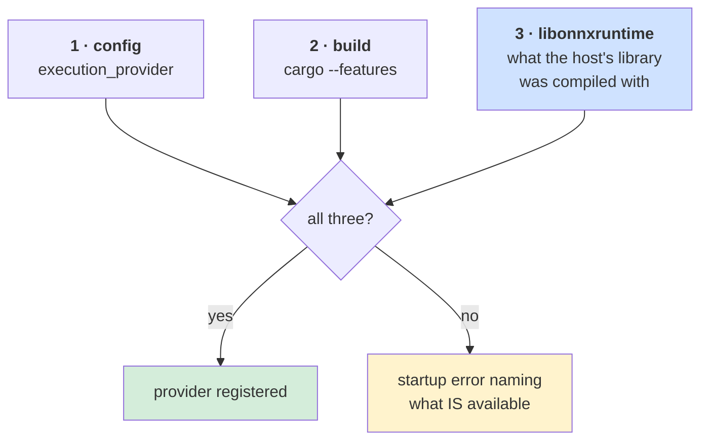
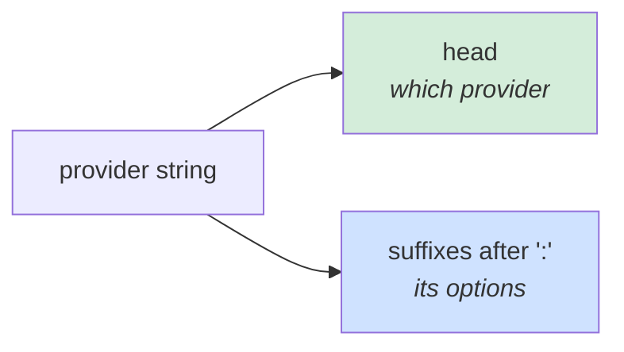
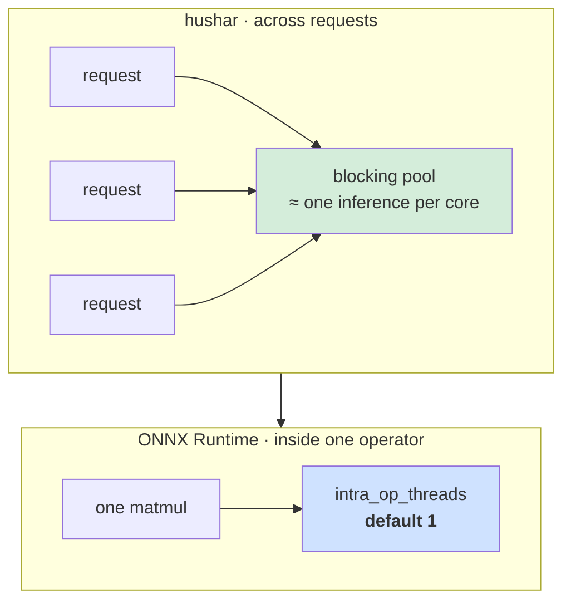
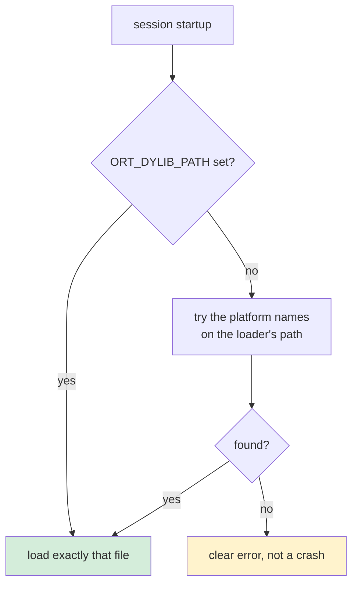
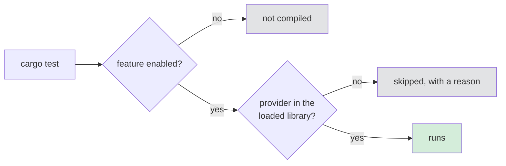

# Hardware

One line of configuration picks the accelerator:

```json
{ "execution_provider": "coreml:cpu_and_neural_engine" }
```

An *execution provider* is ONNX Runtime's term for a hardware backend. Registering one
asks the runtime to place as much of the graph as it can on that device and leave the rest
on the CPU. Registering none runs everything on the CPU.

---

## Three things have to agree



The third is the one that surprises people. A provider is compiled **into**
`libonnxruntime`, and that library is resolved at run time — so no Cargo feature can make
TensorRT exist on a host whose library lacks it. The honest answer to "is TensorRT
available?" can only be given at run time, and the service asks before registering.

A Cargo feature declares *intent*: it lets the build accept that `execution_provider` value
and compiles that provider's tests. A config naming hardware the build was not meant for
fails at startup rather than quietly running somewhere else.

---

## Choosing

| Hardware | `execution_provider` | Cargo feature | Ships in |
|---|---|---|---|
| any CPU | `cpu` | `cpu` *(default)* | every build |
| Apple Silicon | `coreml` | `coreml` | `onnxruntime-osx-*` |
| ARM / mobile CPU | `xnnpack` | `xnnpack` | builds made with `--use_xnnpack` |
| NVIDIA | `tensorrt` or `trt` | `tensorrt` | `onnxruntime-{linux,win}-x64-gpu_cuda12` / `_cuda13` |
| AMD | `migraphx` | `migraphx` | ROCm / MIGraphX builds |

Every one of those is a platform-neutral choice in the config file — the same binary reads
the same `model.json` on a Linux GPU host and an Apple laptop, provided the feature is
compiled in and the host's library has the provider.

```bash
cargo build --release -p hushar                             # CPU only
cargo build --release -p hushar --features coreml
cargo build --release -p hushar --features all-providers    # decide from config
```

`cuda` and `rocm` are **refused by name**, pointing at `tensorrt` and `migraphx`. Both
have dedicated registration paths in ONNX Runtime, so passing them down the generic path
would fail confusingly; naming the supported option is more useful.

Anything unrecognised is passed through as a custom provider name, so a provider added to
ONNX Runtime later needs no change here.

---

## Provider options

A suffix after `:` configures the provider. Order does not matter for CoreML, because
"which hardware" and "which format" are independent choices.



### CoreML — `coreml[:units][:format]`

| Suffix | Effect |
|---|---|
| `all` *(default)* | CPU, GPU and Neural Engine; CoreML places the graph |
| `cpu_and_gpu` | skip the Neural Engine |
| `cpu_and_neural_engine` | skip the GPU — often best for small models |
| `cpu_only` | isolate whether an accuracy change came from the accelerator |
| `mlprogram` *(default)* | the modern format; needed for N-dimensional shapes |
| `neuralnetwork` | the older format, for a host below macOS 12 |

`cpu_and_neural_engine` is frequently the right choice on Apple Silicon: once the model is
resident the Neural Engine has far lower latency than the GPU, and it does not compete with
the display for GPU time.

### The others

| String | Suffix means |
|---|---|
| `xnnpack:4` | intra-op thread count for the provider |
| `tensorrt:0` / `trt:1` | CUDA device id |
| `migraphx:0` | device id |

```json
"execution_provider": "coreml:cpu_and_neural_engine:mlprogram"
"execution_provider": "trt:1"
"execution_provider": "xnnpack:4"
```

---

## Threads

Two independent numbers, and confusing them is the usual cause of a slow deployment:



`intra_op_threads` defaults to 1 because concurrent requests already saturate the machine
— letting one operator fan out across cores adds contention rather than throughput. Raise
it for a large model served at low concurrency, and measure.

---

## Finding the runtime



| Platform | Names tried, in order |
|---|---|
| Windows | `onnxruntime.dll` |
| Apple | `libonnxruntime.1.dylib`, `libonnxruntime.dylib` |
| everything else | `libonnxruntime.so.1`, `libonnxruntime.so` |

The versioned name comes first deliberately: it is the SONAME recorded in the library
itself, so it resolves on any host where the runtime is installed, while the unversioned
name is the linker name usually shipped only in a `-dev` package. Preferring the SONAME
also picks the right library when several major versions are installed side by side.

A runtime older than the vendored header cannot supply a compatible API table, and that is
reported as `UnsupportedApiVersion` rather than crashing.

Prebuilt libraries for every platform are on the
[releases page](https://github.com/microsoft/onnxruntime/releases), named
`onnxruntime-<os>-<arch>-<version>` — see [step 1 of the README](../README.md#1--get-onnx-runtime)
for the asset-to-library mapping. The
[onnxruntime.ai install docs](https://onnxruntime.ai/docs/install/) cover the language
packages (pip, NuGet, npm) rather than the standalone shared library this service loads.

---

## Testing on an accelerator

Provider tests are compiled by the matching feature and skip with a reason when the loaded
library does not have the provider — so the suite stays green everywhere.



```bash
cargo test                            # unit tests only
export ORT_DYLIB_PATH=…               # the library for your platform

cargo test                            # + CPU inference
cargo test --features coreml          # + CoreML, on a Mac
cargo test --features tensorrt        # + TensorRT, on an NVIDIA host
cargo test --features all-providers   # compile every provider's tests
```

To benchmark one provider against another on the same host, `PROVIDERS` is a knob on the
benchmark runner — see [benchmark-data/README.md](../benchmark-data/README.md).

---

## Not ONNX Runtime

[`libnrt-rs`](../libnrt-rs/README.md) is a finished safe wrapper over the AWS Neuron
runtime, for Inferentia and Trainium. The backend trait it would sit behind has four
methods; what is missing is hardware to test against.
