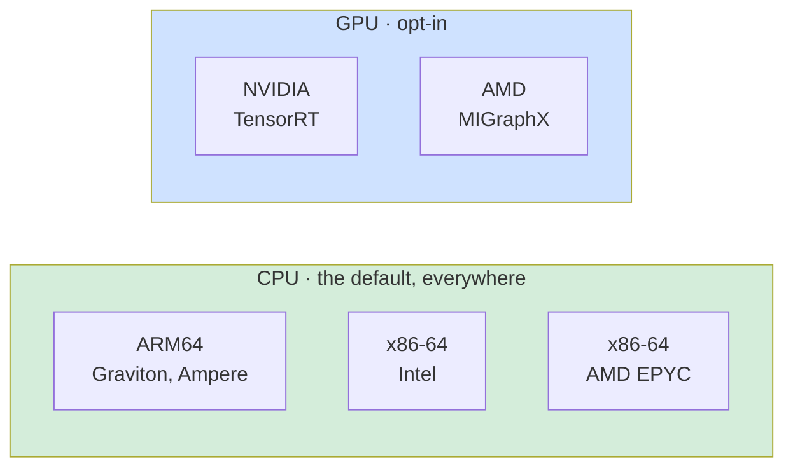
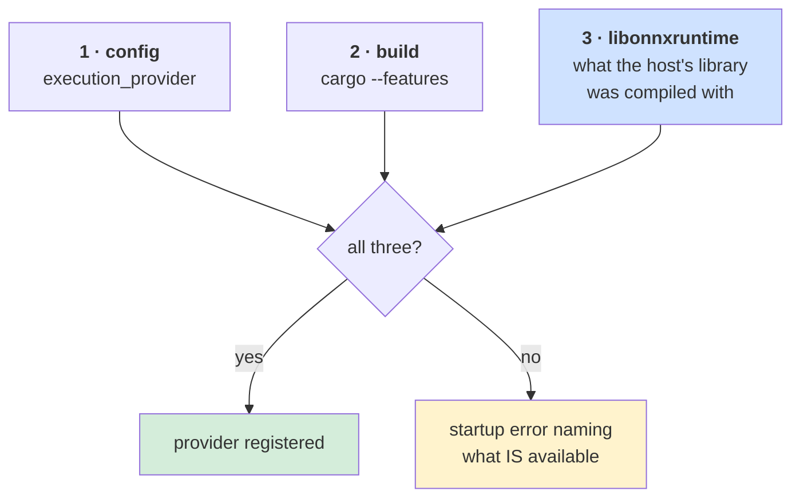
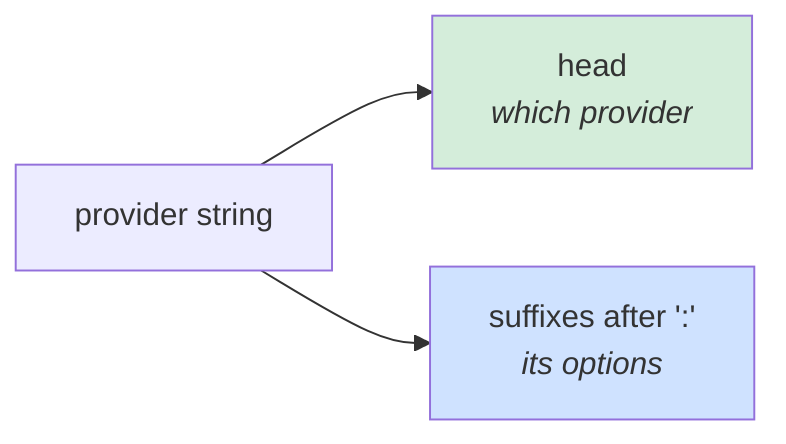
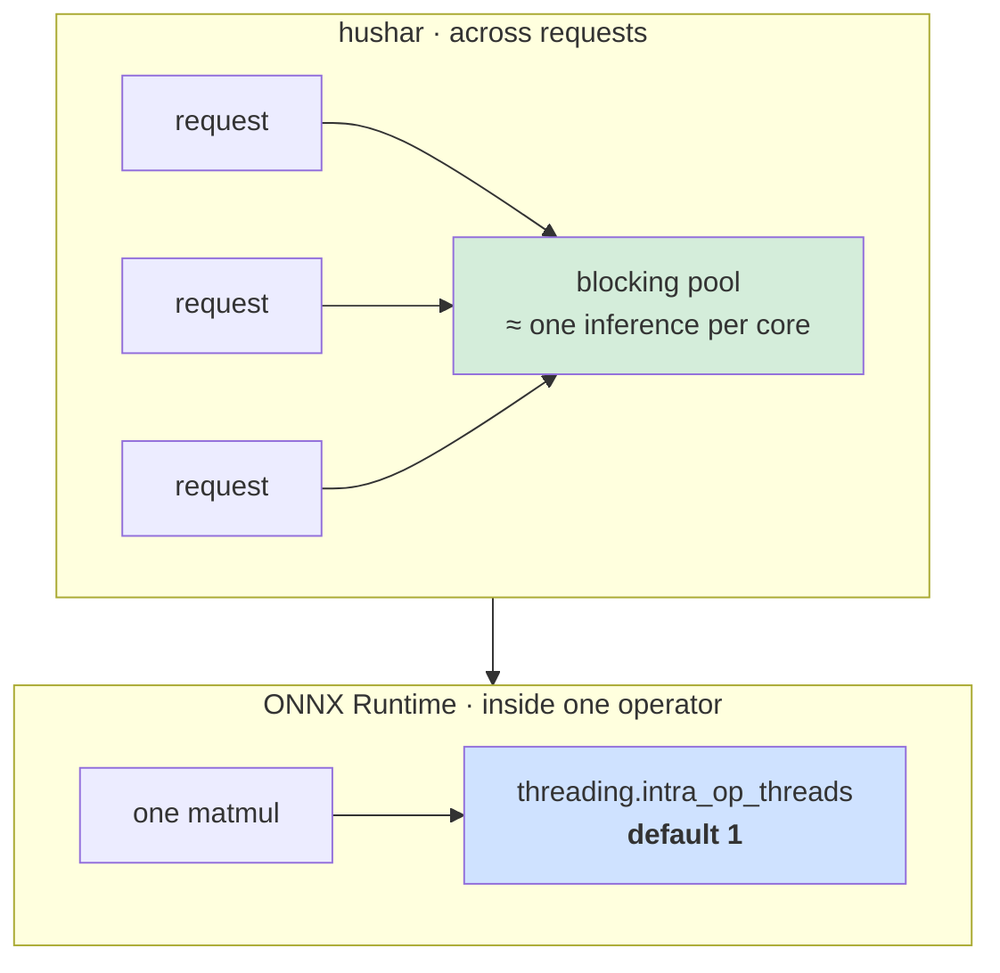
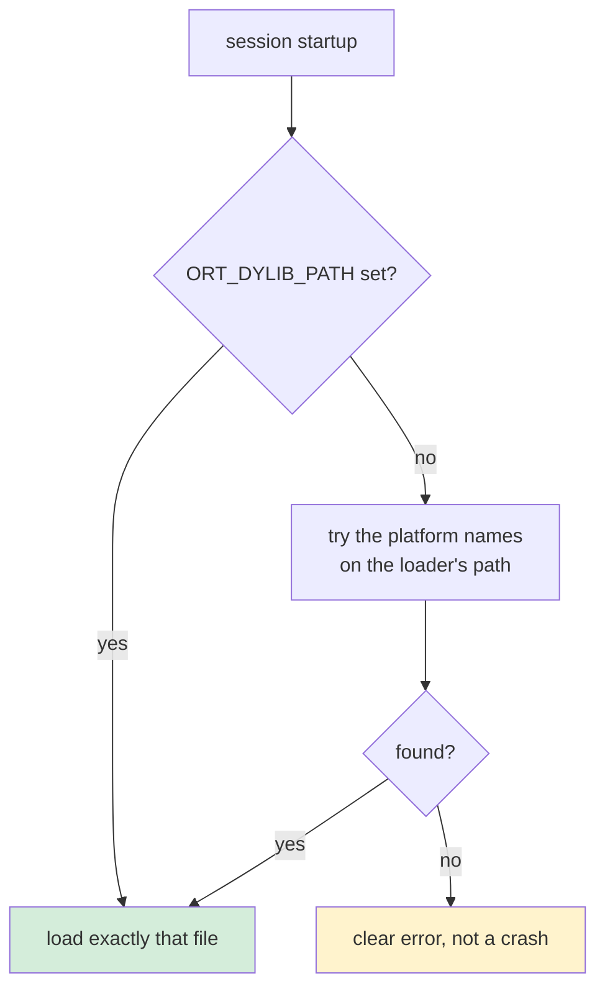
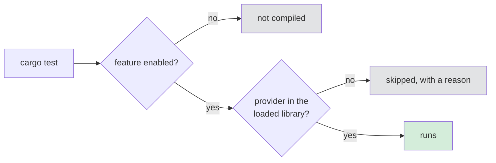

# Hardware

One line of configuration picks the accelerator:

```json
{ "execution_provider": "tensorrt:0" }
```

An *execution provider* is ONNX Runtime's term for a hardware backend. Registering one
asks the runtime to place as much of the graph as it can on that device and leave the rest
on the CPU. Registering none runs everything on the CPU.

The targets this service is built and measured for:



---

## Three things have to agree



The third is the one that surprises people. A provider is compiled **into**
`libonnxruntime`, and that library is resolved at run time — so no Cargo feature can make
TensorRT exist on a host whose library lacks it. The honest answer to "is TensorRT
available?" can only be given at run time, and the service asks before registering.

A Cargo feature declares *intent*: it lets the build accept that `execution_provider` value
and compiles that provider's tests. A config naming hardware the build was not meant for
fails at startup rather than quietly running somewhere else.

---

## Choosing

| Hardware | `execution_provider` | Cargo feature | Ships in |
|---|---|---|---|
| any CPU — ARM64, Intel, AMD | `cpu` | `cpu` *(default)* | every build |
| ARM64 CPU, small models | `xnnpack` | `xnnpack` | builds made with `--use_xnnpack` |
| Intel CPU, GPU or NPU | `openvino` | `openvino` | builds made with `--use_openvino` |
| NVIDIA GPU | `tensorrt` or `trt` | `tensorrt` | `onnxruntime-linux-x64-gpu_cuda12` / `_cuda13` |
| AMD GPU | `migraphx` | `migraphx` | ROCm / MIGraphX builds |

Every one of those is a platform-neutral choice in the config file — the same binary reads
the same `model.json` on a Graviton host and an NVIDIA host, provided the feature is
compiled in and the host's library has the provider.

```bash
cargo build --release -p hushar                             # CPU only
cargo build --release -p hushar --features tensorrt
cargo build --release -p hushar --features all-providers    # decide from config
```

`cuda` and `rocm` are **refused by name**, pointing at `tensorrt` and `migraphx`. Both
have dedicated registration paths in ONNX Runtime, so passing them down the generic path
would fail confusingly; naming the supported option is more useful. Upstream removed the
standalone ROCm provider in favour of MIGraphX, so `migraphx` is the AMD GPU answer.

Anything unrecognised is passed through as a custom provider name, so a provider added to
ONNX Runtime later needs no change here.

---

## CPU is not one thing

The `cpu` provider runs everywhere, but the three CPU families it runs on do not perform
alike, and the difference is in the kernels ONNX Runtime dispatches to:

| Family | What the kernels use | Watch for |
|---|---|---|
| ARM64 — Graviton, Ampere | NEON, and SVE / SME2 via KleidiAI on newer cores | vCPU is a **physical core**, so cores ≈ concurrent inferences |
| x86-64 Intel | AVX2, AVX-512, AMX on Sapphire Rapids and later | a vCPU is a **hyperthread**; two share one core |
| x86-64 AMD EPYC | AVX2, AVX-512 on Zen 4 and later | large L3 per CCX, so a model that fits a CCX behaves differently from one that does not |

Two practical consequences:

- **Do not compare a rate on 16 ARM64 vCPUs with a rate on 16 x86 vCPUs** without saying
  so. The ARM64 host has twice the physical cores.
- **Pin the thread settings, not just the instance.** With `threading.intra_op_threads: 1`
  (the default) throughput scales with cores; a benchmark that leaves the `threading` group
  unset on one host and set on another is measuring two configurations. Record every
  field — `connection_concurrency`, `worker_threads`, `inference_concurrency`,
  `intra_op_threads`, `sessions_per_model` — since the counts multiply.

---

## Provider options

A suffix after `:` configures the provider.



| String | Suffix means |
|---|---|
| `cpu` | *no options* |
| `xnnpack:4` | XNNPACK's own thread-pool size |
| `openvino:cpu` | OpenVINO's `device_type` — `cpu`, `gpu`, `npu`, `gpu.1` |
| `openvino:cpu:threads=96:streams=4` | and its `num_of_threads` / `num_streams` |
| `openvino:auto:gpu,cpu` | a multi-device mode and its device list |
| `tensorrt:0` / `trt:1` | CUDA device id |
| `migraphx:0` | device id |

```json
"execution_provider": "cpu"
"execution_provider": "trt:1"
"execution_provider": "migraphx:0"
"execution_provider": "xnnpack:4"
"execution_provider": "openvino:cpu:threads=96"
```

### OpenVINO options

Only `device_type`, `num_of_threads` and `num_streams` are reachable from the provider
string, and the last two are **deprecated upstream** since ONNX Runtime 1.23 in favour of
`load_config`, which takes a JSON document a provider string cannot carry. They still work;
if a deployment needs anything more — a precision hint, a cache directory, per-device
properties under `AUTO` — that is a change to `ExecutionProvider` in `onnxrt-rs` rather than
a configuration one.

On a CPU, OpenVINO only computes in FP32, so a precision option would have nothing to say.
Leave the thread count out to get OpenVINO's own default of 8, which is almost certainly
wrong on a large server, and set it to the physical core count of one NUMA node instead.

### Sizing the XNNPACK thread pool

XNNPACK keeps a thread pool of its own, separate from ONNX Runtime's, and the two contend.
Upstream's advice is to set XNNPACK's pool to the host's **physical core count** — which is
what the suffix does, passed through as `intra_op_num_threads` at registration. So on a
32-vCPU Graviton host, where a vCPU *is* a physical core:

The two settings live in different files, since one describes the model and the other the
host:

```json
// model.json
{ "execution_provider": "xnnpack:32" }
// service.json
{ "threading": { "intra_op_threads": 1 } }
```

Upstream also recommends disabling ONNX Runtime's intra-op thread spinning alongside this,
via the `kOrtSessionOptionsConfigAllowIntraOpSpinning` session config entry. **hushar cannot
set that today** — `AddSessionConfigEntry` is in the generated bindings but not yet in
`onnxrt-rs`'s safe surface. Some XNNPACK-versus-CPU contention is therefore unavoidable, and
a benchmark comparing the two should say so rather than read the gap as pure kernel quality.

Two more expectations worth setting before measuring XNNPACK on a transformer: it is a
library of **float** neural-network operators aimed at mobile-shaped graphs, so it will claim
the matmuls and hand the rest — normalisations, softmax, the attention reshapes — back to the
CPU provider. A partially claimed graph is the normal outcome, not a misconfiguration, and it
is why XNNPACK does not reliably beat the plain `cpu` provider on a model like this. Measure
`cpu` first so there is a baseline to be surprised against.

### One warmup note for GPUs

TensorRT and MIGraphX **compile** the graph on first use — TensorRT builds an engine,
MIGraphX compiles a program. The first inference after startup can be seconds, not
milliseconds. That is why the benchmark client has a `--warmup-secs`, and why a latency
number taken without warmup on a GPU is meaningless.

---

## Threads

Two independent numbers, and confusing them is the usual cause of a slow deployment:



`threading.intra_op_threads` defaults to 1 because concurrent requests already saturate
the machine — letting one operator fan out across cores adds contention rather than
throughput. Raising it is a latency trade, not a throughput one, and it only pays when
`threading.inference_concurrency` comes down to match: the intra-op pool is per session and
shared, so concurrent callers contend for it. A low-concurrency configuration also has to
run at low utilisation to keep its tail, since one blocking thread is a single-server
queue. See [threads-and-cores.md](threads-and-cores.md) for the whole picture, including
which cores each pool runs on.

---

## Finding the runtime



| Platform | Names tried, in order |
|---|---|
| Linux — every deployment target | `libonnxruntime.so.1`, `libonnxruntime.so` |
| Windows | `onnxruntime.dll` |
| macOS — local development only | `libonnxruntime.1.dylib`, `libonnxruntime.dylib` |

The versioned name comes first deliberately: it is the SONAME recorded in the library
itself, so it resolves on any host where the runtime is installed, while the unversioned
name is the linker name usually shipped only in a `-dev` package. Preferring the SONAME
also picks the right library when several major versions are installed side by side.

A runtime older than the vendored header cannot supply a compatible API table, and that is
reported as `UnsupportedApiVersion` rather than crashing.

### Getting a library

Prebuilt archives are on the
[releases page](https://github.com/microsoft/onnxruntime/releases), named
`onnxruntime-<os>-<arch>-<version>` with the library under `lib/` — see
[step 1 of the README](../README.md#1--get-onnx-runtime) for the asset-to-library mapping.
Two exceptions worth knowing before you plan a run:

| Target | Where the library comes from |
|---|---|
| ARM64, Intel, AMD CPU | `onnxruntime-linux-{x64,aarch64}-<version>.tgz`, straight from the releases page |
| NVIDIA GPU | `onnxruntime-linux-x64-gpu_cuda12-<version>.tgz`, which carries CPU **and** TensorRT |
| XNNPACK | **not** in the default archive; build with `--use_xnnpack` |
| OpenVINO | **not** in the default archive; install OpenVINO, then build with `--use_openvino CPU` |
| AMD GPU | **not** on the releases page; use AMD's ROCm container or build with `--use_migraphx` |

The [onnxruntime.ai install docs](https://onnxruntime.ai/docs/install/) cover the language
packages (pip, NuGet, npm) rather than the standalone shared library this service loads.
[`scripts/benchmark/bootstrap.sh`](../scripts/benchmark/bootstrap.sh) does this fetch for
you on a benchmark instance.

### Building one for XNNPACK

XNNPACK is only prebuilt for Android and iOS, so a Linux host needs a source build. Run it
**on the target instance** — an ARM64 build wants an ARM64 machine, and the compile is the
long part, not the download. `scripts/benchmark/build_ort.sh` is this section as a script,
verified on Amazon Linux 2023.

```bash
scripts/benchmark/build_ort.sh xnnpack     # aarch64
scripts/benchmark/build_ort.sh openvino    # x86-64
```

Four things about the toolchain, each of which fails the build rather than degrading it:

| Need | Because |
|---|---|
| `patch`, `zlib-devel` | ONNX Runtime patches its FetchContent dependencies. Without `patch` the first one dies on `Patch_EXECUTABLE-NOTFOUND` |
| CMake **3.31.x** | 3.31 is the minimum, and CMake 4 dropped compatibility shims the third-party dependencies still rely on. Distribution packages are usually older than the minimum; `pip install "cmake~=3.31.0"` is the easy way to land in the window |
| Python **3.10+** | `tools/ci_build/build.py` uses a `match` statement. AL2023's `python3` is 3.9, and `build.sh` calls it, so drive `build.py` with a newer interpreter directly |
| `--allow_running_as_root` | only if building as root, which is what SSM and most bootstrap paths give you |

```bash
sudo dnf install -y git gcc gcc-c++ make patch zlib-devel protobuf-compiler \
  python3.11 python3.11-pip python3.11-devel
python3.11 -m pip install "cmake~=3.31.0" packaging setuptools wheel numpy
git clone --depth 1 --recursive --branch v1.29.0 https://github.com/microsoft/onnxruntime
cd onnxruntime
python3.11 tools/ci_build/build.py --build_dir build/Linux \
  --config Release --build_shared_lib --parallel "$(nproc)" \
  --use_xnnpack --skip_tests --allow_running_as_root --compile_no_warning_as_error
# -> build/Linux/Release/libonnxruntime.so
```

`--build_shared_lib` is the flag to not forget: without it you get static archives and no
`libonnxruntime.so` for the service to load. On a 192-core instance the XNNPACK build takes
about five minutes; on a small one, closer to an hour.

A MIGraphX build is the same shape, given a ROCm install:

```bash
python3.11 tools/ci_build/build.py --build_dir build/Linux \
  --config Release --build_shared_lib --parallel "$(nproc)" \
  --use_migraphx --migraphx_home /opt/rocm --skip_tests
```

An OpenVINO build needs OpenVINO itself, and two more things beyond the list above:

- **OpenVINO 2026.0 or newer**, for ONNX Runtime 1.29. Anything older is a hard
  `FATAL_ERROR` out of `cmake/onnxruntime_providers_openvino.cmake`, so check this before
  waiting on a compile.
- **GCC 13 or newer.** The OpenVINO EP sources use C++20 `<format>`, which libstdc++ only
  ships from GCC 13. On AL2023 the default GCC 11 fails with
  `fatal error: format: No such file or directory`; install `gcc14`. The XNNPACK EP has no
  such requirement.

There is no need for a full `/opt/intel` install: the PyPI wheel carries the runtime, the
headers and the `OpenVINOConfig.cmake` that `find_package(OpenVINO)` looks for.

```bash
sudo dnf install -y gcc14 gcc14-c++
python3.11 -m pip install "openvino==2026.3.1"
OV=$(python3.11 -c 'import openvino,os; print(os.path.dirname(openvino.__file__))')
export CC=/usr/bin/gcc14-gcc CXX=/usr/bin/gcc14-g++
export OpenVINO_DIR="$OV/cmake" LD_LIBRARY_PATH="$OV/libs:$LD_LIBRARY_PATH"
python3.11 tools/ci_build/build.py --build_dir build/Linux \
  --config Release --build_shared_lib --parallel "$(nproc)" \
  --use_openvino CPU --skip_tests --allow_running_as_root --compile_no_warning_as_error
```

`--use_openvino` takes the device the build targets; `CPU` is what a Xeon server wants.
Upstream also advises turning ONNX Runtime's own graph optimisation **down** for OpenVINO,
on the grounds that OpenVINO optimises better from the unmodified graph. hushar sets
`GraphOptimizationLevel::All` and does not expose that, so an OpenVINO run here is measured
with ONNX Runtime's optimisations applied first. Worth noting in a report, since it is a
difference from Intel's recommended configuration.

These two providers are built as **separate shared libraries**, so
`libonnxruntime_providers_*.so` has to sit beside `libonnxruntime.so` — and for OpenVINO its
own runtime with it. Keep them in one directory and point `LD_LIBRARY_PATH` at it, or the
provider is missing from the banner with no other explanation.

Then point `bootstrap.sh` at the result instead of letting it download:

```bash
ORT_DYLIB_PATH=$HOME/onnxruntime/build/Linux/Release/libonnxruntime.so \
  scripts/benchmark/bootstrap.sh --role server --provider xnnpack
```

The `--provider` here is also a **Cargo feature**, and it is what lets the service accept
that `execution_provider` value at all. A server built without it refuses the configuration
at startup — *"needs the `xnnpack` feature, which this build does not enable"* — even when
the library you just built has the provider compiled in.


---

## Testing on an accelerator

Provider tests are compiled by the matching feature and skip with a reason when the loaded
library does not have the provider — so the suite stays green everywhere.



```bash
cargo test                            # unit tests only
export ORT_DYLIB_PATH=…               # the library for your platform

cargo test                            # + CPU inference
cargo test --features tensorrt        # + TensorRT, on an NVIDIA host
cargo test --features migraphx        # + MIGraphX, on an AMD GPU host
cargo test --features all-providers   # compile every provider's tests
```

To compare one provider against another, run the benchmark on an instance of that
hardware — see [benchmarking.md](benchmarking.md).

---

## Not ONNX Runtime

[`libnrt-rs`](../libnrt-rs/README.md) is a finished safe wrapper over the AWS Neuron
runtime, for Inferentia and Trainium. The backend trait it would sit behind has four
methods; what is missing is hardware to test against.
