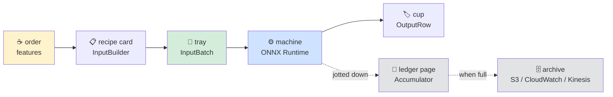
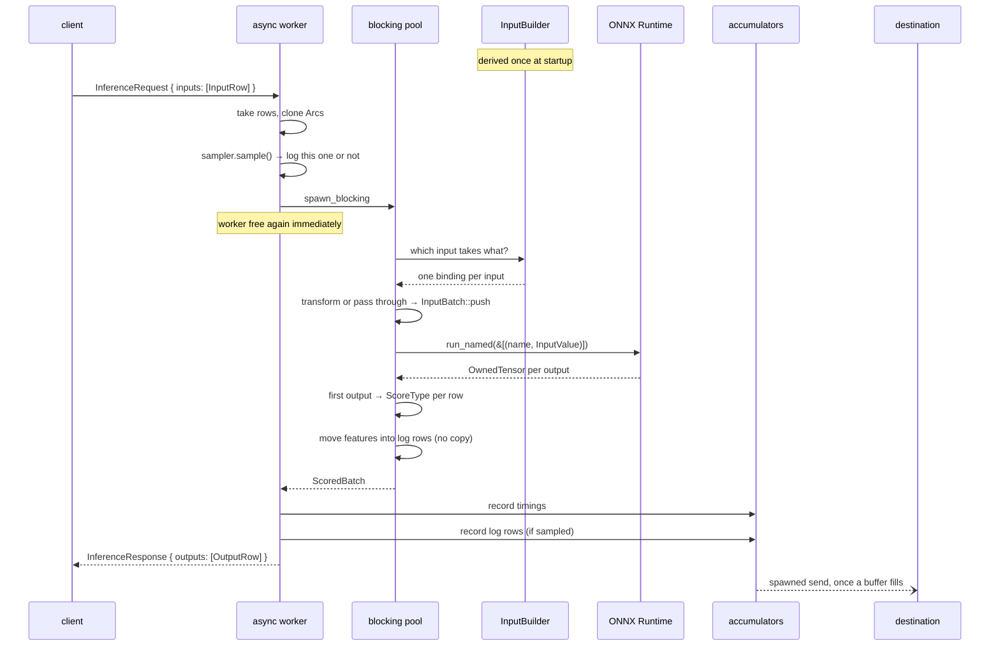
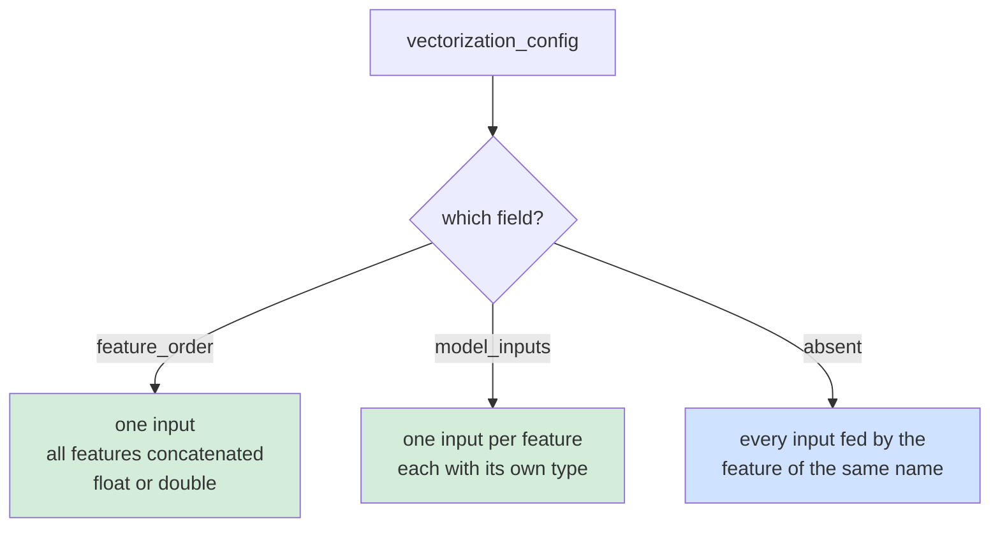
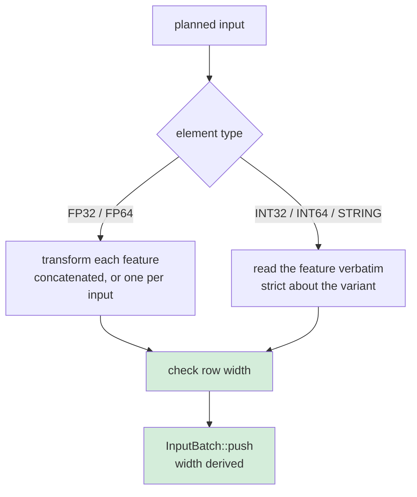
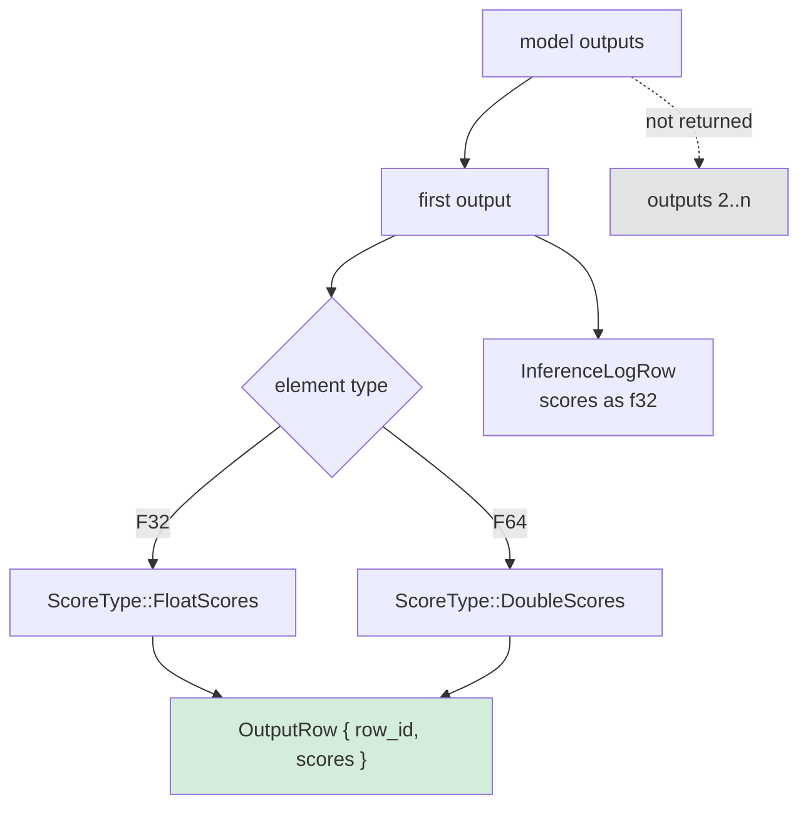
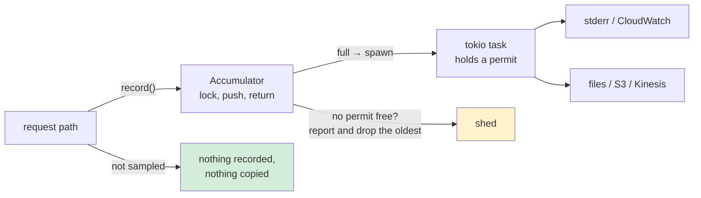

# One inference request, end to end

Follows a single request from the socket to the response, naming the function at each step.
[configuration.md](configuration.md) covers the fields this reads; here it is what actually
happens, in order.

The worked example throughout is the real thing, taken from a running server:

```bash
SMOKE_FEATURES='f1=1.0,f2=2.0,f3=3.0' cargo run -p benchmark-client --example smoke
#   row-0 FP32 = [0.9568927, 0.9568927]
```

---

## ELI5

A request is a **coffee order**.

1. The counter takes your order — a few named things, in your words.
2. The counter does not make the coffee. It hands the order to the kitchen, because if the
   counter stopped to make one, nobody else could order.
3. The kitchen has a **recipe card** written when it opened, saying which order fields go
   into which machine slot.
4. Ingredients get measured out onto a tray, counted once.
5. The machine runs.
6. What comes out is poured into a cup with your name on it.
7. A copy of your order goes in a ledger — jotted on a running page, walked to the archive
   only when the page is full, so nobody waits for the archive.



The recipe card matters most. It is written **once at startup**, not per order, so a
mistake in it stops the shop opening rather than ruining every drink.

---

## The whole journey



The two dotted arrows are the point: everything observability-related leaves the request
path before the response is built, and never blocks it.

---

## Step 1 · The socket

[`HusharService::inference_service`](../hushar/src/main.rs)

```rust
let inference_req = request.into_inner();
let request_id = inference_req.request_id;
let rows = inference_req.inputs;
```

One request shape, so there is nothing to disambiguate. A caller that has already
vectorized sends its vector as one feature whose value is a `FloatArray`.

**ELI5:** the counter reads the order. There is only one kind of order form, so there is no
"which form is this?" step.

---

## Step 2 · Off the async worker

```rust
let scored = tokio::task::spawn_blocking(move || {
    inference::scoring::score_features(backend.as_ref(), rows, &input_builder)
})
.await
.map_err(|e| Status::internal(format!("inference task failed to complete: {e}")))?;
```

Inference is CPU-bound and can run for milliseconds, so it leaves the async runtime. The
blocking pool is capped at `threading.inference_concurrency` in
[`main`](../hushar/src/main.rs) rather than tokio's default 512, which by default keeps
roughly one inference in flight per core.

**ELI5:** the counter hands the order to the kitchen and goes back to taking orders.

---

## Step 3 · The recipe card, checked at startup

[`InputBuilder::resolve`](../hushar/src/inference/input_builder.rs) — called **once**, in
`main`, not per request. It takes the **declared** `vectorization_config` and the model's
own signature, and refuses any disagreement between them.



One rule spans all three, read off the input's element type rather than configured
separately:

> A **float** input is built by a transformation. Any other input is passed through from
> the request **verbatim**.

`resolve` settles each input's element type and its **width**, taking it from the model
where the model fixes it and from the configuration where the model leaves the axis
dynamic. Every input then has a definite width before any request arrives, and the result
is printed so a deployment mistake is visible at boot:

```
hushar: model fraud-v3 loaded on onnxruntime/CPU (runtime 1.29.0)
  inputs   : age FP32[1], city FP32[3], tags STRING[1]
  outputs  : score FP32[1]
  features : 3 binding(s)
             age FP32[1] <- feature "age", transformed
             city FP32[3] <- feature "city", transformed
             tags STRING[1] <- feature "tags", verbatim
```

→ [configuration.md](configuration.md) for the fields. The mapping is declared rather than
inferred from the signature because an ONNX file does not record the schema of the data the
model was trained on — so it has to be stated, and can then be checked against the model.

**ELI5:** the recipe card is checked against the machines when the shop opens. If it does
not match, the shop does not open.

---

## Step 4 · Building the inputs

[`score_features`](../hushar/src/inference/scoring.rs) →
[`InputBuilder::build`](../hushar/src/inference/input_builder.rs), once per model input.



The features are recorded for the log **as received, before any transformation** — and it
costs nothing. `score_features` takes `rows: Vec<InputRow>` by value, so once the inputs are
built each row's feature map is *moved* into its log row; only `row_id` is duplicated. An
earlier version deep-cloned every map up front, which is what owning the rows removed.

| Route | Element types | Missing feature |
|---|---|---|
| transformed | `FP32`, `FP64` | falls back to the transformation's `default_val`, so a partial request still scores |
| verbatim | `INT32`, `INT64`, `STRING` | falls back to `0` or the empty string, repeated to the input's width |

Either route refuses a variant it cannot take rather than converting it: a float fed to an
`INT64` input is refused, not rounded, and a `double_value` fed to a `standardization32`
feature is refused, not narrowed. The one widening allowed is lossless — `INT64` also
accepts an integer. The error names the row, so a bad request is traceable.

The `FP64` route is not the `FP32` route widened — `Identity` and the 64-bit scalers
implement [`transform_f64`](../hushar/src/inference/transformations.rs) directly.

### Our example

```
f1=1.0, f2=2.0, f3=3.0   →  transformed in feature_order  →  [1.0, 2.0, 3.0]
                         →  InputBatch::push("input", F32)  →  width 3
```

`rows` was fixed when the batch was created, so
[`push`](../hushar/src/inference/batch.rs) **derives** the width as `values / rows` — there
is no second number that could disagree with the buffer. It refuses a value count that is
not a whole number of rows, an empty column for a non-empty batch, and a repeated input
name.

**ELI5:** ingredients measured onto a labelled tray, counted once. Anything after this
trusts the tray.

---

## Step 5 · Into the engine

[`OnnxRuntimeBackend::run`](../hushar/src/inference/onnx_backend.rs)

```rust
let rows = inputs.rows();
let mut owned: Vec<Feature> = inputs.into_features();
let names: Vec<String> = owned.iter().map(|c| c.name.clone()).collect();
// shape from the model's spec, because an engine checks rank
// ...
let produced = self.session.run_named(&by_name)?;
```

The trait takes `InputBatch` **by value**. That is load-bearing: owning the features is
what lets [`to_input_value`](../hushar/src/inference/onnx_backend.rs) lend the engine `&mut`
access to each buffer, so numeric tensors are wrapped rather than copied. Text must be
copied — the C API has no borrowing form of `FillStringTensor`.

Coming back, [`from_owned_tensor`](../hushar/src/inference/onnx_backend.rs) reads each
output into a `ScoreData` plus its row count, and `run` checks every declared output came
back with the type it promised and one row per input row.

**ELI5:** the machine is handed the tray itself, not a photocopy.

---

## Step 6 · Scores out

[`run_batch`](../hushar/src/inference/scoring.rs) →
[`to_score_type`](../hushar/src/inference/scoring.rs)



Only the first output is returned, and `FP64` is not narrowed on the way out — the log
narrows to `f32` because it is read by batch jobs that want one stable column. Row count is
checked against the request before anything is read, so outputs can never be correlated to
the wrong rows.

### Our example

```
model output "output" FP32 [1, 2] = [0.9568927, 0.9568927]
  → OutputRow { row_id: "row-0", scores: FloatScores([0.9568927, 0.9568927]) }
```

**ELI5:** poured into a cup with your name on it.

---

## Step 7 · The ledger, on the same thread

Back in [`inference_service`](../hushar/src/main.rs):

```rust
self.metrics_sink.record(&batch.timings);

if logging == FeatureLogging::Record {
    self.data_sink.record(InferenceLogBatch {
        request_id,
        model_id: self.model_id.clone(),
        inference_log_rows: batch.logs,
    });
}
```

Both calls are **synchronous and non-blocking**. Each takes a lock, appends, and returns;
the request that fills a buffer additionally hands the whole batch to a spawned task. No
request ever waits on S3, CloudWatch or Kinesis, and no thread is reserved away from
serving to make that true.



See [`accumulator.rs`](../hushar/src/io/accumulator.rs) for what each request pays and how
memory stays bounded without a channel. The three levers are documented in
[configuration.md](configuration.md#what-the-observability-levers-cost).

**ELI5:** the counter jots your order on a running page and hands you your coffee. When the
page is full someone walks it to the archive. If every runner is still out, the oldest page
is thrown away and the shop writes down that it happened — you still get your coffee.

---

## What the timings actually measure

[`InferenceMicros`](../hushar/src/inference.rs) carries three numbers, emitted under the
names in [`metrics.rs`](../hushar/src/io/metrics.rs):

| Field | Metric name | What it really spans |
|---|---|---|
| `vec_time` | `VectorizationTime` | padding a short batch and building every input tensor |
| `tensor_time` | `ToTensorTime` | `build_start` → `inference_start`: a function call |
| `inference_time` | `InferenceTime` | `backend.run`, the engine itself |

**`ToTensorTime` no longer measures anything meaningful.** The two stages were separate
when tensor construction followed vectorization as its own step; they now happen together
inside `InputBuilder::build`, so `vec_time` covers both. Worth knowing before reading a
dashboard.

---

## The journey in one table

| # | Where | Function | Turns |
|---|---|---|---|
| 1 | `main.rs` | `inference_service` | gRPC → `Vec<InputRow>` |
| 2 | `main.rs` | `spawn_blocking` | async worker → blocking pool |
| 3 | *startup* | `InputBuilder::resolve` | declared config + model signature → planned inputs |
| 4 | `input_builder.rs` | `build` | features → one `Feature` per model input |
| 5 | `onnx_backend.rs` | `run` → `run_named` | `InputBatch` → `OrtValue` → `OutputBatch` |
| 6 | `scoring.rs` | `to_score_type` | first output → `OutputRow` per row |
| 7 | `main.rs` | `record` ×2 | timings and log rows → accumulators |

Where each failure is caught, and whether it stops the server or one request, is tabulated
in [configuration.md](configuration.md#what-is-checked-and-when).

---

## Try it

```bash
export ORT_DYLIB_PATH=…   # the ONNX Runtime library for your platform

hushar --config-uri ./service.json
# read the banner: inputs, outputs, and the feature bindings

SMOKE_FEATURES='f1=1.0,f2=2.0,f3=3.0' \
  SERVER_ADDR=http://127.0.0.1:50051 cargo run -p benchmark-client --example smoke
```

The banner and the response together are the whole contract: what the model wants, where
each input comes from, and what came back.
