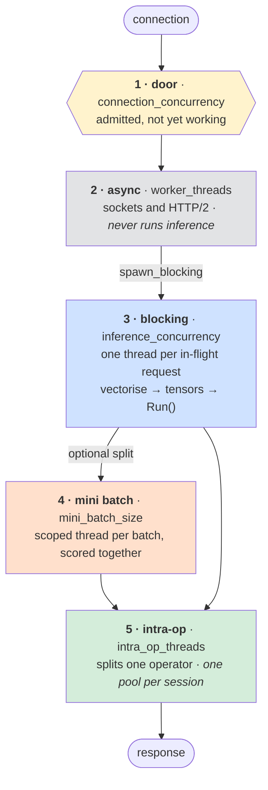

# Threads and cores

How the process spends a machine. The fields are listed in
[configuration.md](configuration.md#threading); this is how to choose them, and where each
one lands in the code.

> **ELI5** — A restaurant. **Waiters** take orders and never cook. **Chefs** cook one
> order each. **Commis** help one chef with one dish. **Kitchens** are separate sets of
> equipment. The **door policy** caps how many orders are accepted at once. Too few chefs
> and the kitchen idles; too many commis and they collide at the same stove.

## Start here

```json
"threading": {
  "worker_threads": 8,
  "inference_concurrency": 8,
  "intra_op_threads": 22,
  "sessions_per_model": 4
}
```

One rule sets the rest:

```text
sessions_per_model × intra_op_threads  ≈  cores      ← one core per thread in a pool
inference_concurrency               ≈  2-3 × sessions_per_model × models
```

The count is **per model**, so the total is `models × this`. The **slices** are not:
there are `sessions_per_model` of them, and replica `i` of every model shares slice `i`.
That asymmetry is the whole story of the next section — a second resident model puts a
second pool on every slice without adding a core to it, which cost 20 % of p50 at
saturation. See [Two models on one host](#two-models-on-one-host).

## The five layers



Layers 4 and 5 are alternative ways to spend cores on **one** request. Use one or the
other: mini batches want `intra_op_threads: 1`.

## Each field: what it does, where it lives, what it costs

| Field | ELI5 | Code | Effect on performance |
|---|---|---|---|
| `connection_concurrency` | door policy | `main.rs` → `Server::builder` (`concurrency_limit_per_connection` + HTTP/2 `max_concurrent_streams`) | Admission only, not work: what it lets past queues for a blocking thread. Bounds **one** connection, so ten connections admit ten times it. Default 500, deliberately flat rather than a multiple of the cores. |
| `worker_threads` | waiters | `main.rs` → `worker_threads()` on the tokio builder | Polls sockets, never blocks. A couple of dozen is plenty on any host. Trimming it gives cores to the engine. |
| `inference_concurrency` | chefs | `main.rs` → `max_blocking_threads()` | **Sets the throughput ceiling**: `achieved ≈ inference_concurrency ÷ service_time`. Too low sheds; too high inflates service time. Size it `≈ TPS × latency × 2`. |
| `intra_op_threads` | commis per dish | `io/model_loader.rs` → `load_onnx_model`, then `OnnxRuntimeBackend::load` | Threads inside one operator. **Trades host throughput against per-request latency, non-monotonically.** Saturates ~7.9× for a 10M transformer. |
| `sessions_per_model` | kitchens | `main.rs` → `replica_placement`, `ServableModel::replica_for_this_thread`; `ThreadingConfig::slice_pressure` | `n` pools per model, each pinned to its own core slice. There are `n` slices, not `models × n`. Stops latency tracking load. Costs one copy of the weights per session. |
| `allow_spinning` | staff wait at the stove | `main.rs` → `session_options_for` (`session.{intra,inter}_op.allow_spinning`) | `false` lets a stalled thread yield its core — what makes oversubscription free. **Set `false` whenever `sessions_per_model > 1`.** |
| `compute_cores` | which stoves | `main.rs` → `session_options_for` via `affinity::ort_affinity`, `pin_compute_thread` | Confines inference. Divided into one contiguous slice per session by `affinity::partition`. |
| `worker_cores` | waiters' station | `main.rs` → tokio `on_thread_start` → `affinity::pin_current_thread` | Keeps connection handling off the compute cores, so a burst cannot preempt an operator. Only useful if disjoint from `compute_cores`. |
| `mini_batch_size` / `is_fixed` | split the dish | `config/model_config.rs`; `inference/scoring.rs` → `score_features` | Model config, not `threading`. Splits a request's rows and scores them together, raising parallelism *per request*. `is_fixed` pads the tail — needed only by a pinned graph. |

The banner prints every one of these at startup. It is the contract: read it before
sending traffic.

### What they are worth, measured

One knob changed at a time, c9g.24xlarge, 10M transformer, two models resident, 400 req/s.
Full detail in [benchmark-data/results](../benchmark-data/results/index.md).

| Change | Effect |
|---|---|
| `intra_op_threads` 1 → 22 (100 rows, unloaded) | 140.4 ms → 19.5 ms; the 45th thread buys nothing |
| `intra_op_threads` 11 → 22 at `sess 4` | −2 to −3 ms at 50 rows, −15 ms at 100 |
| `inference_concurrency` 8 → 24 (100 rows) | sheds 8,523 → serves 400 req/s at 72 ms |
| `sessions_per_model` 4 → 2 at `inf 24` | 72 ms → 1963 ms; four pools cannot hold 24 requests |
| second model resident, same config | 57.1 ms → 68.6 ms; 20 % for a pool it cannot use |
| `mini_batch_size` off → 5 (50 rows) | p95 18.45 ms → 14.38 ms at the same CPU |
| rows 50 → 100 per request | 14.4 ms → 72 ms, and 2× the rows per second |

## The budget

```text
compute threads  =  inference_concurrency  +  sessions × (intra_op_threads − 1)
                    where sessions = models × sessions_per_model
```

`ThreadingConfig::compute_threads` computes it; the banner checks it against the core count
and warns in **both** directions. Too many oversubscribes; far too few silently strands the
machine — a host at a quarter of its budget cannot be saturated by any request rate, which
looks exactly like a slow model.

> **ELI5** — `inference_concurrency` is how many customers you serve at once,
> `intra_op_threads` is how many staff serve each. Their product is your wage bill.

## Why sessions, not just threads

The intra-op pool belongs to the **session**, so one session is one queue: every concurrent
request waits for the same pool and latency climbs with load on an idle host.
`sessions_per_model: n` gives `n` pools, each pinned to its own contiguous slice — so a
request gets a pool to itself.

**With two models resident, `sessions_per_model: 4` is 8 sessions but only 4 slices**, and
the control and candidate replica at the same index share one. Memory is
`models × sessions_per_model × model size`. The banner names the slices and, when two pools
land on one, prints the factor.

Slices are contiguous because neighbouring core ids share a NUMA node and a cache level.
**On a multi-NUMA host, set `compute_cores` within one node** — otherwise a pool straddles
nodes and pays for every cross-node access. Pinning is applied on Linux, and reported as
not applied elsewhere.

Two sizing traps:

- **Pools too small.** Every request gets a pool of its own and is still slow, because the
  pool is below the graph's useful parallelism: `intra 11 · sess 8` measured 87 ms where
  `intra 22 · sess 4` measured 72 ms.
- **Pools shared again.** More `inference_concurrency` than sessions puts two requests back
  on one pool — the thing sessions exist to prevent. `intra 44 · sess 2` gives four pools
  for 24 in-flight requests and collapses to 1963 ms.

## Spinning

`allow_spinning` decides whether idle intra-op threads burn CPU waiting instead of
sleeping. It is ONNX Runtime's default and a real latency win on **one** session.

**With `sessions_per_model > 1`, set it `false`.** Only `inference_concurrency` inferences
run at once, so most pools are idle, and a spinning idle pool costs exactly as much as a
busy one.

It is also what makes *configured* oversubscription affordable: 176 threads on 88 cores
matched the un-oversubscribed latency and then carried a rate the un-oversubscribed
configuration could not reach. That is not a licence to oversubscribe by any means —
oversubscription that comes from a second resident model is a straight cost, below.

## Two models on one host

A roll-out keeps both models resident. `sessions_per_model` counts sessions *per model*,
so the total doubles — but the **slices do not**, because replica `i` of every model shares
slice `i`. The same JSON therefore describes two different operating points, and the
direction surprises people.

Same config, `sess 4 · intra 22 · inf 24`, 100 rows, 400 req/s:

| resident | sessions | threads | p50 | p95 | CPU | RSS |
|---|---|---|---|---|---|---|
| control + candidate | 8 | 192 | 68.6 | 93.1 | 79.2 % | 2.2 GiB |
| control only | 4 | 108 | **57.1** | **79.1** | 75.9 % | 1.3 GiB |

**Removing the candidate makes the service 20 % faster, not slower.** A second resident
model puts a second 22-thread pool on each 22-core slice and a second copy of the weights
in its cache, without adding cores. At low utilisation this is invisible — at 50 rows and
36 % CPU the two are within noise, because a slice holds only ~1.4 requests at a time and
the pools are rarely both busy.

**A split request is immune, and that is the useful lever.** With
`intra_op_threads: 1` and `mini_batch_size` set, parallelism comes from the fan-out rather
than from the pools, so `compute_threads = inference_concurrency + sessions × 0` and the
model count drops out of the arithmetic entirely:

| resident | threads | 100 req/s | 200 req/s | 400 req/s |
|---|---|---|---|---|
| control + candidate | 16 | 12.72 | 13.29 | 14.01 |
| control only | 16 | 12.32 | 13.05 | 13.64 |

Under 3.1 % apart at every rate, against 20 % for the intra-op configuration. If one
configuration has to serve both a roll-out and a single model, that is the one to pick.

## Two things that are not threads

**Rows per request sets the floor.** One request costs a fixed amount of CPU and latency is
that divided by the parallelism it can use. Usable parallelism inside one batch runs out
near 8×, so 100 rows of a 10M transformer cannot go under ~18 ms on an idle
c9g.24xlarge whatever you configure. Below that floor means **fewer rows, or a mini-batch
split** — not more threads.

**One client connection can be its own ceiling.** A tonic `Channel` is one HTTP/2
connection however often it is cloned, and `connection_concurrency` bounds one connection.
Four connections instead of one moved a saturated 96-core host by 3 %, and the gap widens
with host size. Drive load from several connections, or you may be measuring the client.

## Accelerators bring their own pools

An execution provider with its own threadpool ignores `intra_op_threads` for the work it
takes. Set `intra_op_threads: 1`, `allow_spinning: false`, and size the provider's pool
instead — `xnnpack:22`, `openvino:CPU:threads=22`.

Both also **serialise concurrent `Run` on one session**, so their throughput is
`sessions ÷ latency` and no thread setting reaches it. OpenVINO's `streams` is its own
version of `sessions_per_model`. See [hardware.md](hardware.md).

## Next

- [configuration.md](configuration.md#threading) — the fields
- [benchmark-data/results](../benchmark-data/results/index.md) — what these deliver, measured
- [hardware.md](hardware.md) — choosing a provider
